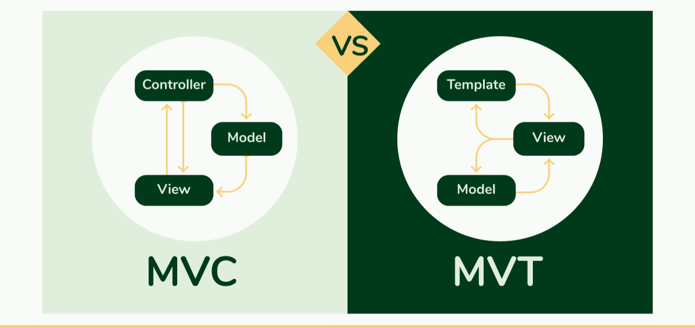
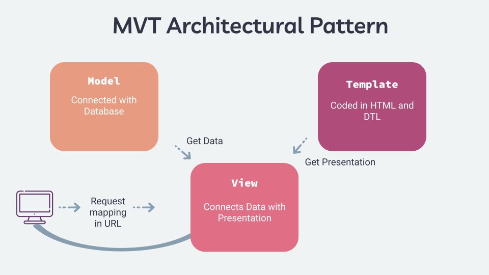

MVT Architektura v Django
=========================

Django je populární webový framework, který následuje architektonický vzor Model-View-Template (MVT). MVT je variací vzoru Model-View-Controller (MVC), který rozděluje záležitosti aplikace do tří komponent: Model, View a Template.

    Porovnání architektury MVC a MVT

Model
-----
Komponenta Model v Django reprezentuje datovou strukturu aplikace. Definuje schéma databáze a poskytuje rozhraní pro interakci s daty. Modely jsou obvykle definovány jako třídy v jazyce Python, které dědí základní třídu `django.db.models.Model`. Definují pole, vztahy a metody pro manipulaci s daty.

View
----
Komponenta View v Django zpracovává logiku aplikace. Přijímá požadavky od uživatele a interaguje s Modelem pro načítání nebo modifikaci dat. View jsou implementovány jako funkce nebo třídy v jazyce Python, které jsou mapovány na konkrétní URL adresy. Zpracovávají požadavek, provádějí potřebné operace a vracejí odpověď.

Template
--------
Komponenta Template v Django je zodpovědná za vykreslování uživatelského rozhraní. Definuje strukturu a rozvržení HTML stránek, které jsou odesílány klientovi. Template může obsahovat dynamický obsah pomocí šablonových tagů a filtrů. Django používá vlastní šablonovací jazyk, který je kombinací HTML a syntaxe podobné Pythonu.

Průběh MVT
----------
Když uživatel pošle požadavek na Django aplikaci, probíhají následující kroky:

1. `URL dispatcher` mapuje URL adresu na konkrétní View.
2. `View` zpracovává požadavek, interaguje s Modelem, pokud je to potřeba, a připravuje data.
3. `View` předává data Template pro vykreslení.
4. `Template` kombinuje data s HTML strukturou a generuje finální HTML stránku.
5. `HTML stránka` je odeslána zpět uživateli jako odpověď.

    Architektura MVT v praxi

Výhody MVT
----------
Architektura MVT v Django nabízí několik výhod:

- **Oddělení zájmů:** MVT odděluje vrstvy dat, logiky a prezentace, což činí kódovou základnu snadněji udržovatelnou a modulární.
- **Opakovatelnost:** Modely, View a Template mohou být znovu použity v různých částech aplikace, což snižuje duplikaci kódu.
- **Testovatelnost:** Každá komponenta může být testována nezávisle, což umožňuje snadnější jednotkové testování a ladění.
- **Flexibilita:** MVT poskytuje flexibilitu při návrhu uživatelského rozhraní a zpracování složitých datových operací.

Závěr
------
Porozumění architektuře MVT v Django je klíčové pro vývoj škálovatelných a udržovatelných webových aplikací. Oddělením zájmů a následováním vzoru MVT mohou vývojáři vytvářet robustní a efektivní kódové základy.