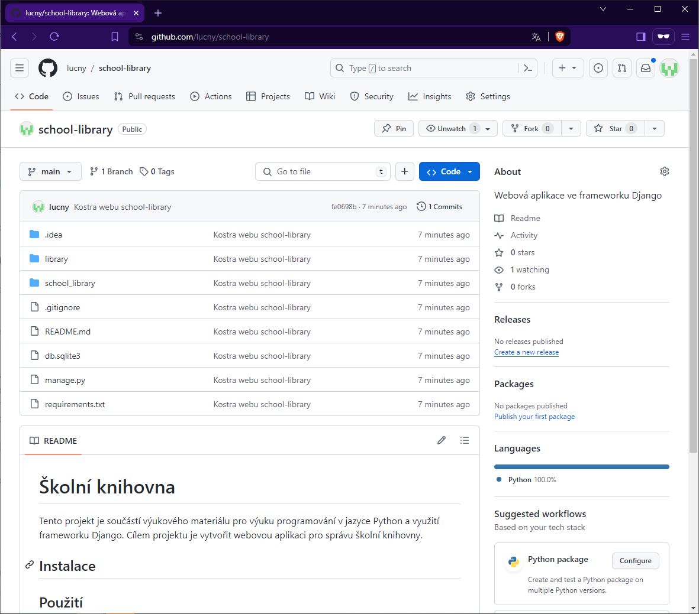
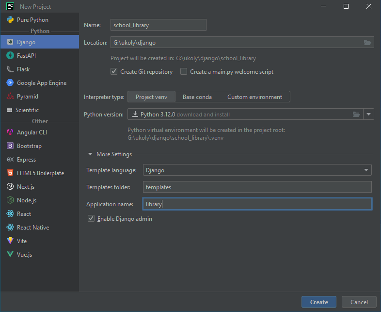
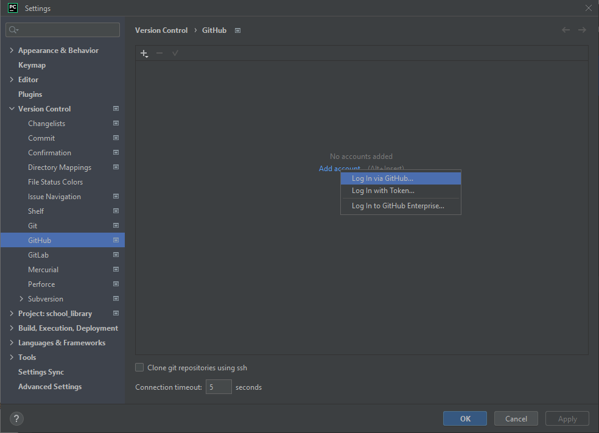
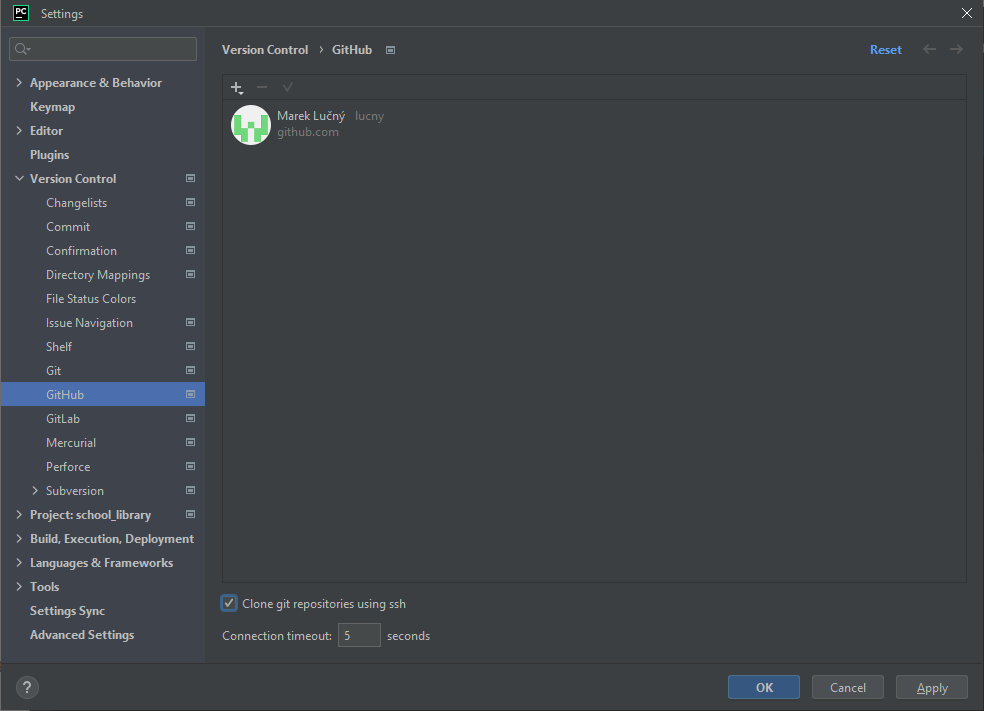
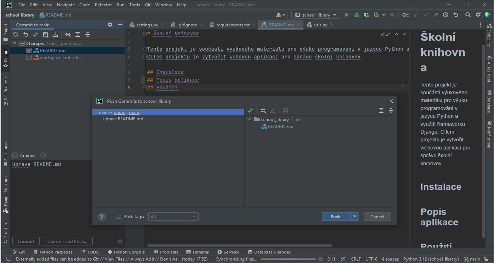
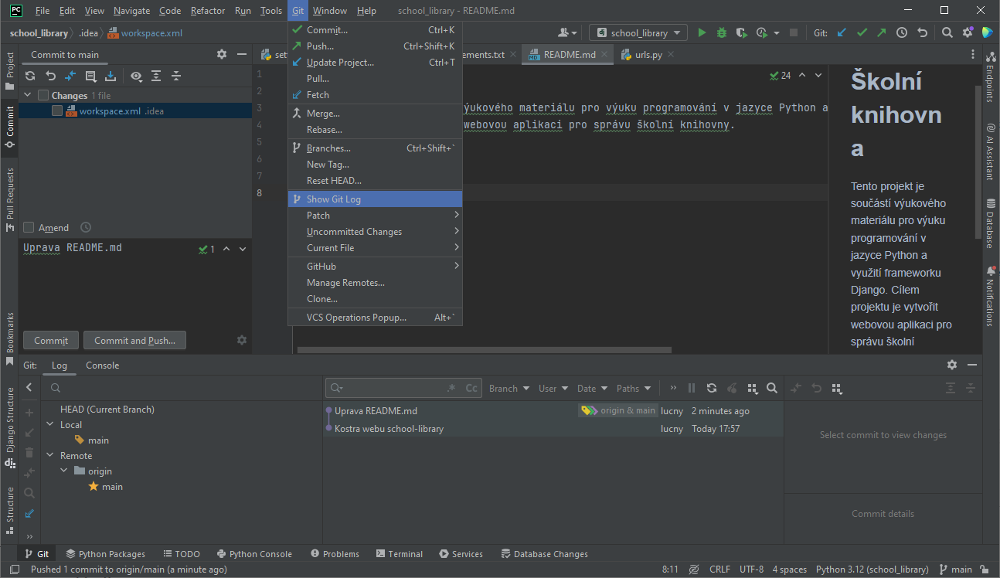

Git repozitář projektu
======================

Poté, co jsme vytvořili základní kostru našeho webu Školní knihovny, je na čase uložit náš projekt. 
Uložení projektu je důležité, protože nám umožní se k němu kdykoliv vrátit a pokračovat v jeho vývoji. 

Verzovací systém Git
--------------------
Ideální způsob, jak uložit projekt, je použití verzovacího systému. Verzovací systém nám umožní ukládat různé verze našeho projektu a pracovat s nimi. 
Nejoblíbenějším verzovacím systémem je Git, který používá mnoho vývojářů zejména v open-source projektech. 
Jeho největší výhodou je, že je zdarma a je k dispozici pro všechny platformy. Podporuje také většinu vývojových prostředí, včetně Visual Studia Code nebo PyCharmu.

Důležité je, že Git je distribuovaný verzovací systém, což znamená, že každý vývojář má celý repozitář na svém počítači a může s ním pracovat offline, 
současně však repozitář může být uložen na vzdáleném serveru, což umožňuje spolupráci na projektu. Vzdálený server může být například GitHub, GitLab nebo Bitbucket; 
pro naše účely použijeme GitHub.

.. note:: 

    Pro práci s verzovacím systémem Git je potřeba mít nainstalovaný Git na lokálním počítači a mít vytvořený účet na GitHubu. 
    O instalaci Gitu a vytvoření účtu na GitHubu si můžete přečíst v `priloha_instalace_git`.

Založení lokálního repozitáře
-----------------------------
Nejprve si pro projekt školní knihovny vytvoříme lokální repozitář na našem počítači. Použijeme k tomu terminál PyCharm nebo příkazový řádek.

Inicializace a konfigurace repozitáře
~~~~~~~~~~~~~~~~~~~~~~~~~~~~~~~~~~~~~
1. Otevřeme terminál v PyCharmu nebo příkazový řádek a přejdeme do složky, kde máme uložený náš projekt.
2. V terminálu nebo příkazovém řádku napíšeme příkaz ``git init``, který vytvoří nový lokální repozitář v naší složce.

    .. code-block:: bash

        git init

3. Před tím, než budeme moci uložit náš projekt do repozitáře, musíme nastavit jméno a email, které budou spojeny s našimi změnami. 
   To uděláme příkazy ``git config --global user.name "Jméno Příjmení"`` a ``git config --global user.email "e-mailová adresa"``.

    .. code-block:: bash

        git config --global user.name "Jméno Příjmení"
        git config --global user.email "e-mailová adresa"

    .. note:: 
            
        Uvedený způsob nastavení jména a emailu je globální, což znamená, že se použije pro všechny repozitáře na našem počítači. 
        Alternativně můžeme jméno a email nastavit pouze pro aktuální repozitář pomocí příkazů 
        ``git config user.name "Jméno Příjmení"`` a ``git config user.email "e-mailová adresa"``. 
        To je vhodné v případě, že chceme použít různá jména a emaily pro různé projekty, nebo pokud sdílíme počítač s jinými uživateli.

Přidání souborů .gitignore a README.md
~~~~~~~~~~~~~~~~~~~~~~~~~~~~~~~~~~~~~~~
Součástí projektu, který verzujeme pomocí Gitu, by měly být soubory ``.gitignore`` a ``README.md``. 

Soubor ``.gitignore`` obsahuje seznam souborů a složek, které nechceme verzovat, například soubory s citlivými daty nebo soubory, které se generují automaticky. 

Soubor ``README.md`` obsahuje popis projektu a jeho použití. 

1. Vytvoříme soubor ``.gitignore`` a otevřeme ho v PyCharm nebo libovolném textovém editoru. Do souboru napíšeme následující obsah:

    .. code-block:: bash

        .idea/
        .venv/
        __pycache__/
        *.pyc
        *.pyo
        *.pyd
        .pytest_cache/

    Tento obsah souboru říká, že nechceme verzovat soubory s koncovkou ``.pyc``, ``.pyo`` a ``.pyd``, které se generují automaticky, 
    a složku ``__pycache__``, která obsahuje soubory s přeloženým kódem. 
    Složka ``.venv`` obsahuje virtuální prostředí, které vytvoříme v následujících lekcích, a složka ``.idea`` obsahuje nastavení projektu v PyCharmu.

2. Vytvoříme soubor ``README.md`` a otevřeme ho v PyCharm nebo libovolném textovém editoru. Do souboru napíšeme následující obsah:

       .. code-block:: markdown
    
            # Školní knihovna
    
            Tento projekt je součástí výukového materiálu pro výuku programování v jazyce Python a využití frameworku Django. 
            Cílem projektu je vytvořit webovou aplikaci pro správu školní knihovny.
    
            ## Instalace
            ## Použití
             
Vytvoření souboru requirements.txt
~~~~~~~~~~~~~~~~~~~~~~~~~~~~~~~~~~~
Dalším důležitým souborem, který by měl být součástí projektu, je soubor ``requirements.txt``. 
Obsahuje seznam všech závislostí (knihoven), které jsou potřeba pro běh projektu.

Soubor můžeme vytvořit ručně nebo pomocí příkazu ``pip freeze > requirements.txt``, který vygeneruje soubor s aktuálními verzemi všech nainstalovaných knihoven.

.. code-block:: bash

    pip freeze > requirements.txt

Obsah souboru bude vypadat nějak takto:

.. code-block:: bash

    asgiref==3.7.2
    Django==5.0.3
    sqlparse==0.4.4
    tzdata==2024.1

Přidání souborů do repozitáře
~~~~~~~~~~~~~~~~~~~~~~~~~~~~~~
Po vytvoření souborů ``.gitignore``, ``README.md`` a ``requirements.txt`` můžeme přidat všechny soubory a složky v naší složce do repozitáře. 

Provedeme to pomocí příkazů ``git add`` a ``git commit``. 
První z nich přidá soubory do tzv. staging area, což je přechodný stav před uložením do repozitáře, 
kdy můžeme zkontrolovat, zda jsou všechny soubory správně připraveny k uložení.
Druhý příkaz uloží soubory do repozitáře a přidá k nim zprávu, která popisuje, co jsme změnili.

1. V terminálu nebo příkazovém řádku napíšeme příkaz ``git add .``, který přidá všechny soubory a složky v naší složce do repozitáře.

    .. code-block:: bash

        git add .

2. Nyní máme připravené soubory k uložení. Přidáme je do repozitáře pomocí příkazu ``git commit -m "Kostra webu school-library"``.

    .. code-block:: bash

        git commit -m "Kostra webu school-library"

    V závorce za příkazem ``git commit -m`` je zpráva, která popisuje, co jsme změnili. 
    Tato zpráva by měla být stručná a výstižná, aby bylo jasné, co bylo změněno.

3. K ověření, zda jsme soubory úspěšně přidali do repozitáře, můžeme použít příkaz ``git status``, který nám ukáže, jaké soubory jsou připraveny k uložení a jaké změny jsme provedli.

    .. code-block:: bash

        git status

    Pokud vše proběhlo správně, měli bychom vidět následující výstup:

    .. code-block:: bash

        On branch master
        nothing to commit, working tree clean

    To znamená, že jsme úspěšně přidali soubory do repozitáře a nemáme žádné další změny k uložení.

4. Chceme-li se podívat na historii změn, které jsme provedli, můžeme použít příkaz ``git log``, který nám ukáže seznam všech změn v repozitáři.

    .. code-block:: bash

        git log --oneline

    Výstup může vypadat nějak takto:

    .. code-block:: bash

        fe0698b (HEAD -> main) Kostra webu school-library
    

Založení vzdáleného repozitáře na GitHubu
-----------------------------------------

1. Přejdeme na stránku GitHubu a přihlásíme se do svého účtu.
2. Klikneme na tlačítko ``+`` a příkaz ``New repository`` v pravém horním rohu a vyplníme název repozitáře a popis. 
   Můžeme také vybrat, zda bude repozitář veřejný nebo soukromý.

    .. figure:: media/github_new_repo.png
        :alt: Vytvoření nového repozitáře na GitHubu
        :align: center

    Vytvoření nového repozitáře na GitHubu    

3. Klikneme na tlačítko ``Create repository``.
4. Na následující stránce se zobrazí návod, jak propojit lokální repozitář s vzdáleným repozitářem na GitHubu. 

    .. figure:: media/github_repo_setup.png
        :alt: Návod na propojení lokálního a vzdáleného repozitáře
        :align: center

    Návod na propojení lokálního a vzdáleného repozitáře

Zabezpečení vzdáleného repozitáře
---------------------------------
Vzdálený repozitář na GitHubu je veřejný, což znamená, že je přístupný pro všechny uživatele. 
Pro jeho zabezpečení můžeme použít SSH klíče, které nám umožní přihlásit se na GitHub bez nutnosti zadávat uživatelské jméno a heslo.

.. note:: 

    SSH klíče jsou pár klíčů, které se používají k autentizaci uživatele. 
    Každý pár obsahuje veřejný klíč, který se sdílí, a soukromý klíč, který zůstává na lokálním počítači. 
    Používají se například k přihlášení na vzdálený server nebo k ověření identity uživatele. 
    
    SSH klíče zajišťují vyšší úroveň zabezpečení než běžné uživatelské jméno a heslo, protože je mnohem obtížnější je prolomit. 
    Metoda RSA je jednou z nejčastěji používaných metod pro generování SSH klíčů a používá se i na GitHubu. Jde o asymetrický šifrovací algoritmus, 
    který je založen právě na existenci dvou rozdílných klíčů: veřejného a soukromého. Chránit je nutné soukromý klíč, veřejný klíč může být sdílen.
    
    Pro použití SSH klíčů na GitHubu je nutné mít vygenerované SSH klíče na lokálním počítači a přidat veřejný klíč na GitHub.

K tomu je nutné provést následující kroky:

Vygenerování SSH klíčů na lokálním počítači
~~~~~~~~~~~~~~~~~~~~~~~~~~~~~~~~~~~~~~~~~~~
1. Otevřeme terminál v PyCharmu nebo příkazový řádek a napíšeme příkaz ``ssh-keygen -t rsa -b 4096 -C "e-mailová adresa"``, 
   kde ``e-mailová adresa`` je e-mailová adresa, kterou máme na GitHubu.

    .. code-block:: bash

        ssh-keygen -t rsa -b 4096 -C "e-mailová adresa"

    Po spuštění příkazu se zobrazí následující výstup:

    .. code-block:: bash

        Generating public/private rsa key pair.
        Enter a file in which to save the key (/Users/you/.ssh/id_rsa): [Press enter]

    Tímto příkazem jsme vygenerovali SSH klíče, které jsou uloženy v naší domovské složce v adresáři ``.ssh``. 
    Klíče jsou uloženy ve dvou souborech: ``id_rsa`` (soukromý klíč) a ``id_rsa.pub`` (veřejný klíč).

    .. figure:: media/ssh_keygen.png
        :alt: Vygenerované SSH klíče ve složce .ssh
        :align: center
   
    Vygenerované SSH klíče ve složce .ssh

Přidání veřejného klíče na GitHub
~~~~~~~~~~~~~~~~~~~~~~~~~~~~~~~~~~
1. Otevřeme soubor ``id_rsa.pub`` v textovém editoru a zkopírujeme jeho obsah.

    .. code-block:: bash

        cat ~/.ssh/id_rsa.pub

2. Přejdeme na stránku GitHubu a přihlásíme se do svého účtu.
3. Klikneme na svůj profil v pravém horním rohu a vybereme možnost ``Settings``.
4. V levém menu vybereme možnost ``SSH and GPG keys`` a klikneme na tlačítko ``New SSH key``.
5. Do pole ``Title`` napíšeme název našeho počítače, např. ``My laptop``.
6. Do pole ``Key`` vložíme obsah souboru ``id_rsa.pub``.
7. Klikneme na tlačítko ``Add SSH key``.

    .. figure:: media/github_ssh_key.png
        :alt: Přidání veřejného klíče na GitHub
        :align: center

    Přidání veřejného klíče na GitHub 

Připojení vzdáleného repozitáře k lokálnímu repozitáři
------------------------------------------------------
Po zabezpečení vzdáleného repozitáře můžeme připojit lokální repozitář k vzdálenému repozitáři na GitHubu. 

V terminálu nebo příkazovém řádku napíšeme příkaz ``git remote add origin URL``, kde ``URL`` je URL adresa našeho repozitáře na GitHubu.

.. code-block:: bash

    git remote add origin URL

Například:

.. code-block:: bash

    git remote add origin git@github.com:lucny/school-library.git

Tímto příkazem jsme přidali vzdálený repozitář s názvem ``origin`` a URL adresou našeho repozitáře na GitHubu. 

Ověřit si, zda je repozitář připojený, můžeme pomocí příkazu ``git remote -v``.

.. code-block:: bash

    git remote -v

    origin  git@github.com:lucny/school-library.git (fetch)
    origin  git@github.com:lucny/school-library.git (push)

Odeslání změn do vzdáleného repozitáře
--------------------------------------
Po připojení vzdáleného repozitáře můžeme odeslat změny z lokálního repozitáře do vzdáleného repozitáře na GitHubu.

V terminálu nebo příkazovém řádku napíšeme příkaz ``git push -u origin main``, který odesílá změny z lokálního repozitáře do vzdáleného repozitáře. 

- Parametr ``-u`` nastaví vzdálený repozitář jako výchozí, což znamená, že příkaz ``git push`` bude odesílat změny do tohoto repozitáře. 
- Parametr ``origin`` určuje název vzdáleného repozitáře. 
- Parametr ``main`` určuje název větve, kterou chceme odeslat.

.. code-block:: bash

    git push -u origin main

    Enumerating objects: 32, done.
    Counting objects: 100% (32/32), done.
    Delta compression using up to 16 threads
    Compressing objects: 100% (29/29), done.
    Writing objects: 100% (32/32), 14.33 KiB | 916.00 KiB/s, done.
    Total 32 (delta 1), reused 0 (delta 0), pack-reused 0
    remote: Resolving deltas: 100% (1/1), done.
    To github.com:lucny/school-library.git
    * [new branch]      main -> main
    Branch 'main' set up to track remote branch 'main' from 'origin'.

Tímto příkazem jsme odeslali změny z lokálního repozitáře do vzdáleného repozitáře na GitHubu.
O úspěšném odeslání změn nás informuje výstup, který obsahuje informace o počtu odeslaných objektů a kompresi dat. 

Ověřit si, zda jsou změny úspěšně odeslány, můžeme pomocí příkazu ``git log --oneline``.

.. code-block:: bash

    git log --oneline

    fe0698b (HEAD -> main, origin/main) Kostra webu school-library

Výstup obsahuje informaci o tom, že jsme změny odeslali do vzdáleného repozitáře. 
V závorce je uveden název větve, na které jsme pracovali, a název vzdáleného repozitáře, kam jsme změny odeslali.

Pokud se podíváme na náš repozitář na GitHubu, měli bychom vidět, že jsou změny úspěšně odeslány.

Změny odeslané do vzdáleného repozitáře

PyCharm a Git
-------------
PyCharm má vestavěnou podporu pro verzovací systém Git, což znamená, že můžeme pracovat s repozitářem přímo v PyCharmu. 
Může nám to ušetřit čas a velmi usnadnit práci s repozitářem.

Předpokladem opět je, že máme nainstalovaný Git na našem počítači a máme vytvořený účet na GitHubu, ideálně s SSH klíči. 

Inicializace a konfigurace repozitáře
~~~~~~~~~~~~~~~~~~~~~~~~~~~~~~~~~~~~~
V PyCharmu můžeme pro náš projekt nastavit již vytvořený git repozitář a propojit ho s vzdáleným repozitářem na GitHubu. 
Podrobný popis naleznete na oficiální stránkách `JetBrains <https://www.jetbrains.com/help/pycharm/2023.3/enabling-version-control.html#associate_directory_with_VCS>`_.

Ideální je myslet na inicializaci a konfiguraci repozitáře hned na začátku vytváření projektu, protože nám to ušetří čas a usnadní práci s repozitářem.
Stačí při vytváření projektu zaškrtnout volbu ``Create a new Git repository`` a následně propojit projekt s vzdáleným repozitářem na GitHubu.

Inicializace git repozitáře v PyCharmu

Propojení s GitHub
~~~~~~~~~~~~~~~~~~ 
K propojení je třeba mít nainstalovaný plugin GitHub, který je součástí balíčku PyCharm Professional Edition. Samotný účet nastavíme 
v sekci File -> Settings -> Version Control -> GitHub.

Aktivace GitHub účtu v PyCharmu

Aktivace proběhne automaticky, stačí se přihlásit do svého účtu na GitHubu a autorizovat přístup k repozitářům.

Po úspěšném propojení s GitHub se v okně objeví ikona s názvem připojeného účtu. Zaškrtnutím volby ``Clone git repositories using SSH`` můžeme použít SSH klíče pro rychlý přístup k repozitářům.

Nastavení GitHub účtu v PyCharmu

Práce s git repozitářem v PyCharmu
~~~~~~~~~~~~~~~~~~~~~~~~~~~~~~~~~~
Po propojení s GitHubem můžeme vytvářet nové repozitáře, odesílat změny do vzdáleného repozitáře, vytvářet nové větve a provádět další operace s repozitářem přímo v PyCharmu.
Všechny operace jsou dostupné prostřednictvím menu Git nebo malé lišty, které se nachází v pravém horním rohu.

K sledování změn můžeme použít i panel Commit, který nám ukáže, jaké změny jsme provedli a jaké soubory jsou připraveny k uložení.

Můžeme například provést malou změnu v souboru ``README.md``, přidat soubor do repozitáře a odeslat změny do vzdáleného repozitáře na GitHubu, jak naznačuje následující obrázek.

Panel Commit v PyCharmu

Příkazem ``Show Git Log`` v menu ``Git`` si můžeme zobrazit historii změn, které jsme provedli v repozitáři.

Historie změn v repozitáři