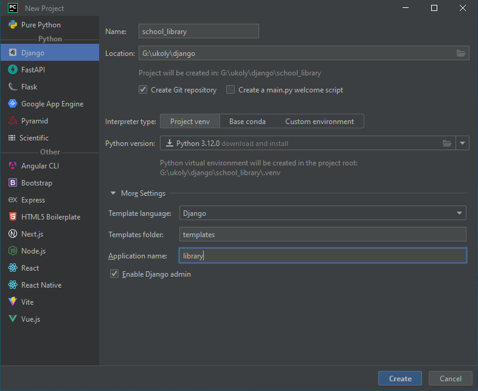
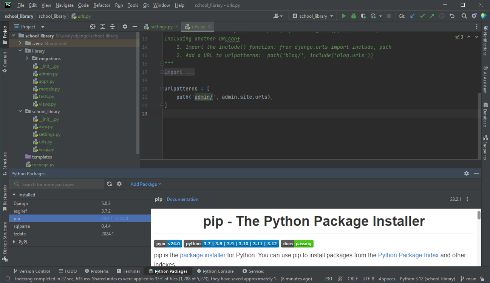

Založení projektu
=================

Vytvoření projektu v Django je prvním krokem při vytváření webové aplikace. 

Při založení kostry projektu pro stránky naší plánované školní knihovny budeme postupovat následovně:

1. Vytvoříme nový adresář pro náš projekt.
2. Vytvoříme virtuální prostředí pro izolaci knihoven a balíčků.
3. Aktivujeme virtuální prostředí a nainstalujeme Django.
4. Vytvoříme nový Django projekt s názvem `school_library`.
5. Spustíme vývojový server a ověříme, že vše funguje.
6. Vytvoříme novou aplikaci pro správu knihovny.

Použití příkazové řádky
-----------------------

Adresář projektu
''''''''''''''''

Nejprve si ukážeme, jak vytvořit nový adresář pro náš projekt. Otevřeme příkazovou řádku a spustíme následující příkazy:

.. code-block:: bash

    # Vytvoříme nový adresář s názvem "school_library"
    mkdir school_library

    # Přejdeme do nově vytvořeného adresáře
    cd school_library

Virtuální prostředí
'''''''''''''''''''

Virtuální prostředí je izolované prostředí, které umožňuje instalovat balíčky a knihovny nezávisle na ostatních projektech. 
To znamená, že můžeme mít různé verze knihoven v různých projektech, aniž bychom měli problémy s konflikty verzí. 
Vytvoření virtuálního prostředí je dobrým zvykem, který bychom měli dodržovat při vytváření nových projektů.

Vytvoření virtuálního prostředí provedeme ve Windows následujícím příkazem:

.. code-block:: bash

    # Vytvoříme nové virtuální prostředí s názvem ".venv"
    python -m venv .venv

V Linuxu a macOS použijeme následující příkaz:

.. code-block:: bash

    # Vytvoříme nové virtuální prostředí s názvem ".venv"
    python3 -m venv .venv

Aktivace virtuálního prostředí
''''''''''''''''''''''''''''''

Předtím, než budeme moci používat virtuální prostředí, musíme ho aktivovat. 

V systému Windows použijeme následující příkaz:

.. code-block:: bash

    # Aktivujeme virtuální prostředí
    .venv\Scripts\activate

V Linuxu a macOS použijeme následující příkaz:

.. code-block:: bash

    # Aktivujeme virtuální prostředí
    source .venv/bin/activate

Po aktivaci virtuálního prostředí se v příkazové řádce zobrazí název virtuálního prostředí, který bude vypadat následovně:

.. code-block:: bash

    (.venv) \path\to\your\project\school_library>

Instalace Django
''''''''''''''''

Nyní, když máme aktivované virtuální prostředí, můžeme nainstalovat Django.

Použijeme následující příkaz:

.. code-block:: bash

    # Nainstalujeme Django
    pip install django

Balíček `pip` je správce balíčků pro Python, který umožňuje instalovat a spravovat balíčky a knihovny. Nainstaluje framework Django a všechny jeho závislosti.

Vytvoření projektu
''''''''''''''''''

Nyní, když máme Django nainstalováno, můžeme vytvořit nový projekt. V našem případě bude název projektu `school_library`.

Použijeme následující příkaz:

.. code-block:: bash

    # Vytvoříme nový projekt s názvem "school_library"
    django-admin startproject school_library .

.. note::

    Nezapomeňte na tečku na konci příkazu. Tím říkáme, že chceme vytvořit projekt v aktuálním adresáři. 
    Pokud tečku vynecháme, Django vytvoří nový adresář s názvem `school_library` a vytvoří projekt uvnitř tohoto adresáře.

Po spuštění tohoto příkazu bychom měli mít následující strukturu adresářů:

.. code-block:: bash

    school_library/
    ├── manage.py
    └── school_library/
    |   ├── __init__.py
    |   ├── asgi.py
    |   ├── settings.py
    |   ├── urls.py
    |   └── wsgi.py

Spuštění vývojového serveru
'''''''''''''''''''''''''''

Nyní, když máme vytvořený projekt, můžeme spustit vývojový server a ověřit, že vše funguje. 

Přejdeme do adresáře, kde je náš projekt, a spustíme následující příkaz:

.. code-block:: bash

    # Spustíme vývojový server
    python manage.py runserver

Po spuštění tohoto příkazu bychom měli vidět následující výstup:

.. code-block:: bash

    Watching for file changes with StatReloader
    Performing system checks...

    System check identified no issues (0 silenced).

    You have 18 unapplied migration(s). Your project may not work properly until you apply the migrations for app(s): admin, auth, contenttypes, sessions.
    Run 'python manage.py migrate' to apply them.
    March 07, 2024 - 22:25:50
    Django version 5.0.3, using settings 'school_library.settings'
    Starting development server at http://127.0.0.1:8000/
    Quit the server with CTRL-BREAK.

Otevřeme webový prohlížeč a přejdeme na adresu ``http://127.0.0.1:8000/`` a měli bychom vidět následující stránku:

   
    Django funguje!

Gratulujeme! Právě jste vytvořili nový projekt v Django a spustili vývojový server.
Jestliže vás zaráží hlášení o neaplikovaných migracích, nebojte se. 
Migrace jsou nástroj, kterým Django spravuje změny v databázi. O migracích se dozvíte více v dalších kapitolách.

Projekt a aplikace
------------------

Ve frameworku Django jsou pojmy **projekt** a **aplikace** dvě základní struktury, které se používají k organizaci kódu, ale mají odlišné účely a význam.

Projekt
'''''''
Projekt v Django je celková webová aplikace se všemi jejími součástmi. 
Reprezentuje celou webovou aplikaci, kterou vyvíjíte, a slouží jako kontejner pro nastavení, konfigurace a aplikace, které tvoří webovou stránku. 
Projekt obsahuje soubor nastavení (např. settings.py), konfigurace URL (např. urls.py), a často globální soubory, jako jsou šablony nebo statické soubory, 
které se vztahují k celému webu. Projekt také spravuje databázi a může obsahovat více aplikací, které spolupracují na vytvoření celé webové stránky.

Aplikace
''''''''
Aplikace je samostatná, opakovaně použitelná komponenta, která vykonává konkrétní funkci a může být přidána do libovolného projektu Django. 
Aplikace by měla být navržena tak, aby byla co nejvíce opakovaně použitelná, idealně tak, aby ji bylo možné přidat do jakéhokoliv projektu Django bez nutnosti modifikace. 
Typicky obsahuje modely, pohledy, šablony a URL, které spolu souvisí a spolupracují na poskytování nějaké specifické funkcionality 
(např. blog, systém komentářů, systém správy uživatelů).

Klíčové rozdíly
'''''''''''''''

- **Rozsah:** Projekt představuje celou webovou aplikaci, zatímco aplikace je jedna z jejích částí, zaměřená na určitou funkcionalitu.
- **Opakovaná použitelnost:** Aplikace by měla být opakovaně použitelná, což znamená, že by měla být schopna fungovat v různých projektech s minimálními nebo žádnými změnami. Projekt na druhou stranu je specifický pro konkrétní webovou stránku.
- **Struktura:** Projekt obsahuje konfigurační soubory a může obsahovat mnoho aplikací. Aplikace jsou samostatné komponenty uvnitř projektu, které se starají o specifické aspekty funkcionality webové stránky.

Tato dělba umožňuje Django projektům být modulární a udržitelné, kde různé aplikace mohou být vyvíjeny, testovány a laděny nezávisle jedna na druhé.

Vytvoření aplikace
''''''''''''''''''

V našem případě budeme vytvářet aplikaci pro správu knihovny. Vytvoříme aplikaci s názvem `library`.

Přejdeme do adresáře projektu a spustíme následující příkaz:

.. code-block:: bash

    # Vytvoříme novou aplikaci s názvem "library"
    python manage.py startapp library

Po spuštění tohoto příkazu bychom měli mít následující strukturu adresářů:

.. code-block:: bash

    school_library/
    ├── library/
    │   ├── __init__.py
    │   ├── admin.py
    │   ├── apps.py
    │   ├── migrations/
    │   │   └── __init__.py
    │   ├── models.py
    │   ├── tests.py
    │   └── views.py
    ├── manage.py
    └── school_library/
    |   ├── init__.py
    |   ├── asgi.py
    |   ├── settings.py
    |   ├── templates/
    |   ├── urls.py
    |   └── wsgi.py

Vytvořením aplikace `library` jsme založili také nový adresář s názvem `library`. V tomto adresáři budeme vyvíjet všechny součásti aplikace, jako jsou modely, pohledy, šablony a URL.

Použití IDE Pycharm
-------------------

Vytvoření projektu i aplikace
'''''''''''''''''''''''''''''
Pokud používáte IDE Pycharm, můžete vytvořit nový projekt a aplikaci přímo z rozhraní IDE, a to v jednom kroku. 
Stačí kliknout na tlačítko ``Create New Project`` a vybrat Django jako typ projektu. Jeho nastavení vidíte na následujícím obrázku:

   
   Vytvoření nového projektu v Pycharm
  
Po kliknutí na tlačítko ``Create`` musíme chvíli počkat, než Pycharm vytvoří nový projekt i s virtuálním prostředím.

Když je vše hotovo, uvidíme v levém panelu nový projekt a v něm adresáře, které jsme vytvořili v předchozích krocích.

    Struktura projektu v Pycharm

Díky automatizovanému procesu vytvoření projektu v Pycharm nemusíme vytvářet virtuální prostředí, instalovat Django, ani vytvářet nový projekt a aplikaci.    

Nastavení interpretu
''''''''''''''''''''
To, že je opravdu vše připraveno, můžeme ověřit v nastavení projektu, do něhož se dostaneme kliknutím na tlačítko ``File`` a volbu ``Settings``. 
Zde v nastavení projektu vybereme ``Python Interpreter`` a uvidíme, že Pycharm vytvořil nové virtuální prostředí a nainstaloval Django.

    Nastavení Python Interpreter v Pycharm

Stejné okno můžeme použít i k vytvoření nového virtuálního prostředí (příkaz ``Add Interpreter``), pokud bychom chtěli vytvořit nový projekt postupně 
nebo kdybychom otevřeli už existující projekt bez virtuálního prostředí. 

Je zde rovněž možné instalovat nové balíčky a knihovny (prostřednictvím tlačítka ``+``), nebo je případně i odinstalovat (tlačítko ``-``).

Správa balíčků
''''''''''''''
Podrobnější informace o nainstalovaných balících a knihovnách nabízí také okno **Python Packages**, které můžeme vyvolat kliknutím na tlačítko ``Python Packages`` 
v liště nástrojů zpravidla v dolní části obrazovky.

    Python Packages v Pycharm

Okno ``Python Packages`` umožňuje snadnou správu balíčků a prostřednictvím odkazu ``Documentation`` se můžeme rychle dostat na stránky s dokumentací k dané knihovně.

Příkazová řádka
'''''''''''''''
Pokud bychom chtěli použít příkazovou řádku, můžeme ji otevřít přímo v Pycharm. Stačí kliknout na tlačítko ``Terminal`` v dolní části obrazovky. 

Je-li aktivní virtuální prostředí, uvidíme to v závorce před příkazovou řádkou. Pokud ne, můžeme ho ve Windows aktivovat příkazem `.venv\\Scripts\\activate`, 
nebo v Linuxu a macOS příkazem `source .venv/bin/activate`.

Využijeme ji hned k tomu, abychom zjistili, co vše nám nabízí modul ``manage.py`` - správce projektu Django. Stačí zadat příkaz `python manage.py`:

    Příkazy Django v Pycharm

Po spuštění příkazu `py manage.py` (zkrácenou verzi příkazu `python manage.py` můžeme používat od verze Python 3.8) 
uvidíme všechny volby, které můžeme použít k práci s projektem. K těm nejčastěji používaným patří:

- `runserver` - spuštění vývojového serveru
- `startapp` - vytvoření nové aplikace
- `makemigrations` - vytvoření migrací
- `migrate` - aplikace migrací
- `createsuperuser` - vytvoření nového superuživatele
- `shell` - spuštění interaktivního Python shellu

V dalších kapitolách narazíme i na jiné příkazy a vysvětlíme si jejich význam i možnosti použití.

