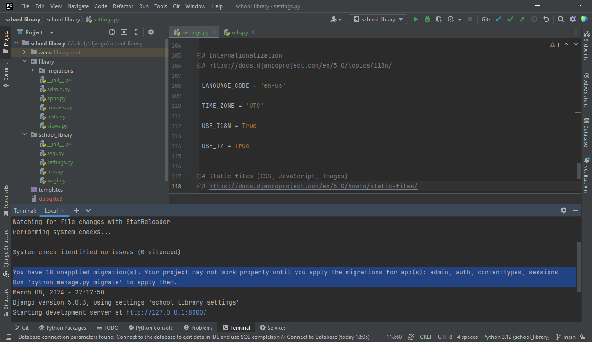
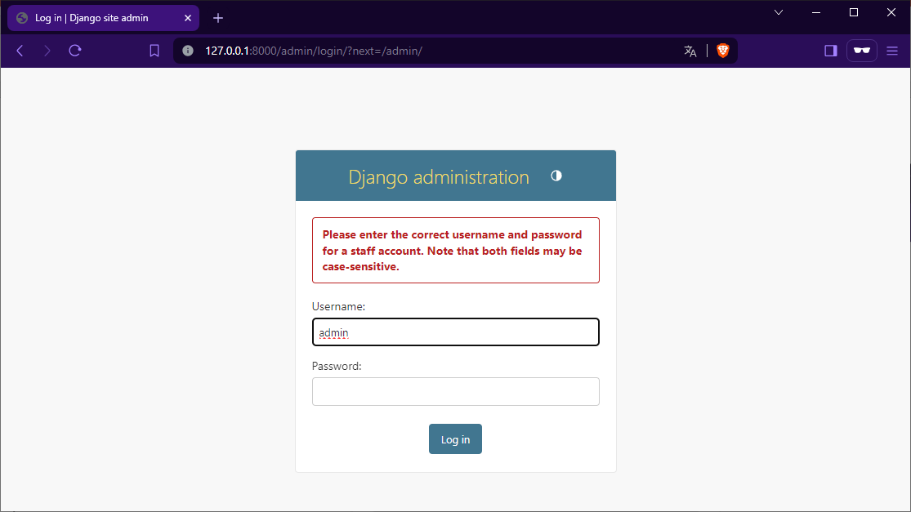
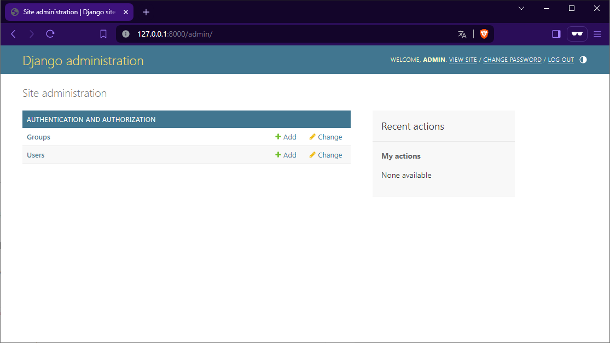

Migrace a administrace
======================

Úspěšně jsme založili nový projekt pro web školní knihovny, seznámili se s jeho strukturou a provedli i drobné změny v konfiguraci. 
Příkazem ``python manage.py runserver`` jsme spustili vývojový server a zkontrolovali, že vše funguje.

Ovšem během spuštění serveru se nám zobrazilo upozornění, že pro správné fungování aplikace je nutné provést tzv. migrace.

    Upozornění na nutnost provedení migrace

Co jsou migrace?
----------------

Migrace jsou změny v databázi, které se provádí pomocí ORM nástroje Django. Migrace se používají pro vytváření, úpravy a mazání tabulek a sloupců v databázi.
Zkrátka, migrace slouží k tomu, aby se struktura databáze přizpůsobila aktuálnímu stavu aplikace.

Proč ale máme migraci provést, když jsme zatím jen vytvořili nový projekt a neudělali jsme žádné vědomé změny v databázi?

Důvodem je, že Django vytváří migrace automaticky. Při vytvoření nové aplikace, při změně modelu, při změně v konfiguraci aplikace a při instalaci nových balíčků.
Už samotné vytvoření nového projektu způsobí, že Django připraví migraci, která má za úkol vytvořit základní tabulky pro správu uživatelů a skupin. 
Jedná se o tabulky, které jsou součástí Django a které jsou potřeba pro správné fungování aplikace.

Zobrazení migrací
-----------------
Jak zjistit, které migrace jsou připravené k provedení? 

Pomocí příkazu ``python manage.py showmigrations`` zjistíme, které migrace jsou připravené k provedení a které nejsou.

.. code:: bash

    $ python manage.py showmigrations
    admin
    [ ] 0001_initial
    [ ] 0002_logentry_remove_auto_add
    [ ] 0003_logentry_add_action_flag_choices
    auth
    [ ] 0001_initial
    [ ] 0002_alter_permission_name_max_length
    [ ] 0003_alter_user_email_max_length
    [ ] 0004_alter_user_username_opts
    [ ] 0005_alter_user_last_login_null
    [ ] 0006_require_contenttypes_0002
    [ ] 0007_alter_validators_add_error_messages
    [ ] 0008_alter_user_username_max_length
    [ ] 0009_alter_user_last_name_max_length
    [ ] 0010_alter_group_name_max_length
    [ ] 0011_update_proxy_permissions
    [ ] 0012_alter_user_first_name_max_length
    contenttypes
    [ ] 0001_initial
    [ ] 0002_remove_content_type_name
    library
    (no migrations)
    sessions
    [ ] 0001_initial

Výstup příkazu ``showmigrations`` nám ukazuje, že: 

- Pro aplikaci ``admin`` je připravena migrace ``0001_initial``.
- Pro aplikaci ``auth`` je připraveno několik migrací, které se týkají úprav tabulek pro správu uživatelů a skupin.
- Pro aplikaci ``contenttypes`` je připravena migrace ``0001_initial`` a podobně pro aplikaci ``sessions``.
- Pro naší aplikaci ``library`` nejsou připraveny žádné migrace. To je logické, protože jsme zatím vytvořili jen novou aplikaci, ale žádné změny v databázi jsme neudělali.

Provedení migrací
-----------------
Migrace se provádějí pomocí příkazu ``python manage.py migrate``. Tento příkaz provede všechny migrace, které jsou připravené k provedení.

.. code:: bash

    $ python manage.py migrate
    Operations to perform:
    Apply all migrations: admin, auth, contenttypes, sessions
    Running migrations:
    Applying contenttypes.0001_initial... OK
    Applying auth.0001_initial... OK
    Applying admin.0001_initial... OK
    Applying admin.0002_logentry_remove_auto_add... OK
    Applying admin.0003_logentry_add_action_flag_choices... OK
    Applying contenttypes.0002_remove_content_type_name... OK
    Applying auth.0002_alter_permission_name_max_length... OK
    Applying auth.0003_alter_user_email_max_length... OK
    Applying auth.0004_alter_user_username_opts... OK
    Applying auth.0005_alter_user_last_login_null... OK
    Applying auth.0006_require_contenttypes_0002... OK
    Applying auth.0007_alter_validators_add_error_messages... OK
    Applying auth.0008_alter_user_username_max_length... OK
    Applying auth.0009_alter_user_last_name_max_length... OK
    Applying auth.0010_alter_group_name_max_length... OK
    Applying auth.0011_update_proxy_permissions... OK
    Applying auth.0012_alter_user_first_name_max_length... OK
    Applying sessions.0001_initial... OK

Výstup příkazu ``migrate`` nám ukazuje, že byly provedeny migrace pro všechny aplikace, které byly připravené k provedení.
Nyní bychom měli mít v databázi vytvořeny tabulky pro správu uživatelů a skupin, které jsou součástí Django.

Znovu příkazem ``showmigrations`` zkontrolujeme, že všechny migrace byly provedeny.

.. code:: bash

    $ python manage.py showmigrations
    admin
    [X] 0001_initial
    [X] 0002_logentry_remove_auto_add
    [X] 0003_logentry_add_action_flag_choices
    auth
    [X] 0001_initial
    [X] 0002_alter_permission_name_max_length
    [X] 0003_alter_user_email_max_length
    [X] 0004_alter_user_username_opts
    [X] 0005_alter_user_last_login_null
    [X] 0006_require_contenttypes_0002
    [X] 0007_alter_validators_add_error_messages
    [X] 0008_alter_user_username_max_length
    [X] 0009_alter_user_last_name_max_length
    [X] 0010_alter_group_name_max_length
    [X] 0011_update_proxy_permissions
    [X] 0012_alter_user_first_name_max_length
    contenttypes
    [X] 0001_initial
    [X] 0002_remove_content_type_name
    library
    (no migrations)
    sessions
    [X] 0001_initial

Výstup příkazu ``showmigrations`` nám ukazuje, že všechny migrace byly provedeny a že všechny aplikace jsou v pořádku.

Nyní můžeme příkazem ``python manage.py runserver`` spustit vývojový server a zkontrolovat, že vše funguje.

Administrace Django
-------------------

Kromě úvodní stránky, která nám ukazuje, že vše funguje, můžeme zkontrolovat, zda už je k dispozici také administrace Django. 
Administrace Django je webové rozhraní, které umožňuje správu uživatelů, skupin, oprávnění a dalších dat v databázi. 
Je to velmi užitečný nástroj, který nám ušetří spoustu práce.

Přejdeme na adresu ``http://127.0.0.1:8000/admin/`` a zobrazí se nám přihlašovací formulář do administrace. 

Můžeme se pokusit přihlásit s uživatelským jménem ``admin`` a heslem ``admin``. Výsledkem je bohužel chyba, protože uživatel s tímto jménem a heslem neexistuje.

    Přihlašovací formulář do administrace

Chyba je logická, protože jsme zatím nevytvořili žádného uživatele pro administraci Django.

Vytvoření superuživatele
-------------------------

Musíme tedy vytvořit uživatele, který bude mít právo se přihlásit do administrace Django. 

Přerušíme běh vývojového serveru příkazem ``Ctrl+C`` a vytvoříme uživatele příkazem ``python manage.py createsuperuser``.
Příkaz nás vyzve k zadání uživatelského jména, e-mailové adresy a hesla.

.. note:: 

    Příkaz ``createsuperuser`` naznačuje, že vytvoříme **superuživatele**, což je uživatel s nejvyššími právy. 
    V Django je to uživatel má plný přístup do administrace Django a má právo vytvářet, mazat a upravovat uživatele, skupiny, oprávnění a další data v databázi.
    

.. code:: bash
   
    $ python manage.py createsuperuser
    Username (leave blank to use 'ml'): admin
    Email address: admin@school-library.cz
    Password: admin
    Password (again): admin
    The password is too similar to the username.
    This password is too short. It must contain at least 8 characters.
    This password is too common.
    Bypass password validation and create user anyway? [y/N]: y
    Superuser created successfully.

Zadaný e-mail je pochopitelně jen fiktivní a heslo "admin" příliš jednoduché, ale přesto bylo uživatelské jméno a heslo přijato, 
když jsme potvrdili, že chceme uživatele vytvořit.

.. caution:: 
    
    V produkčním prostředí bychom samozřejmě nikdy nepoužili tak jednoduché heslo jako "admin". 
    Musíme si uvědomit, že heslo je jedinou ochranou před neoprávněným přístupem do administrace. 
    Při nasazení aplikace na produkční server bychom měli použít nejen silné heslo, ale raději i jiné uživatelské jméno než "admin".

Administrační rozhraní
----------------------

Nyní můžeme znovu spustit vývojový server příkazem ``python manage.py runserver`` a přihlásit se do administrace Django.

Přihlášení nyní již proběhne úspěšně a zobrazí se nám úvodní stránka administrace Django.

    Úvodní stránka administrace Django

Administrace Django je nyní připravena k použití a můžeme v ní spravovat uživatele, skupiny, oprávnění a další data v databázi.
