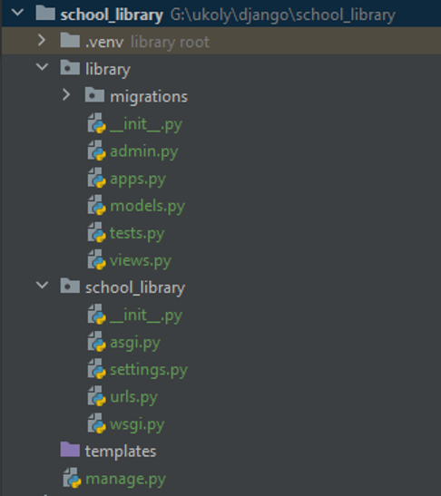

Struktura projektu v Django
===========================

Nyní je čas podrobněji se podívat na to, co je vlastně obsahem naší projektové složky. 

Po vytvoření projektu Django se vytvoří několik souborů a složek, které tvoří kostru budoucí webové prezentace. 

I z tohoto důvodu je Django označováno jako **framework**, protože vývojářům poskytuje základní strukturu, 
kterou je možné dále rozvíjet a upravovat podle potřeb konkrétního projektu. Pro úspěšný vývoj webové aplikace je důležité, 
aby její tvůrce byl schopen se v této struktuře orientovat a věděl, kde co hledat. 
Současně by měl být schopen tuto strukturu upravovat a přizpůsobovat konkrétním požadavkům.

Vše si nejlépe ukážeme na konkrétním příkladu, na kostře projektu školní knihovny, kterou jsme vytvořili v předchozí lekci. 
Připomeňme si, že kromě projektu nazvaného **school_library** jsme vytvořili také základní aplikaci a nazvali jsme ji **library**.

Struktura projektu školní knihovny
----------------------------------

Po inicializaci projektu Django se vytvořila následující základní struktura souborů a složek:

    Struktura projektu školní knihovny

``library/``
  Složka obsahuje součástí aplikace ``library``. Vznikla při vytvoření aplikace pomocí příkazu ``python manage.py startapp library``. 

  ``migrations/``
    Složka obsahuje migrace databáze - skripty pro změnu struktury databáze. Migrace jsou vytvářeny automaticky při změně modelů a aplikovány na databázi při spuštění příkazu ``python manage.py migrate``. 
    Jednotlivé soubory obsahují instrukce pro vytvoření, změnu nebo odstranění tabulek, sloupců, klíčů a dalších prvků databáze. Jsou označeny číslem, které určuje pořadí aplikace migrací.

  ``__init__.py``
    Prázdný soubor, který Pythonu říká, že složka může být importována jako modul. Tato konvence se používá pro všechny složky, které mají být považovány za Python moduly.

  ``admin.py``
    Soubor, který umožňuje registraci modelů v administračním rozhraní Django.

  ``apps.py``
    Soubor, ve kterém se konfiguruje aplikace ``library``. Součástí konfigurace je například název aplikace, popis, nebo způsob, jakým se má aplikace chovat při spuštění projektu.

  ``models.py``
    Definuje strukturu databázových tabulek, tzv. modely Django. Modely jsou třídy, které reprezentují tabulky v databázi a definují strukturu a chování dat.

  ``tests.py``
    Soubor pro psaní testů k ověření správné funkčnosti aplikace. Testy jsou spouštěny příkazem ``python manage.py test``.

  ``views.py``
    Obsahuje pohledy (views), které řídí, co se má uživateli zobrazit na webu. Na základě požadavku uživatele se zde zpracovávají data a připravují k zobrazení v šablonách.

``school_library/``
  Hlavní složka Django projektu, obsahující konfigurační a inicializační soubory. Vznikla při vytvoření projektu pomocí příkazu ``django-admin startproject school_library``.

  ``__pycache__/``
    Složka obsahující soubory s přeloženým kódem pro rychlejší načítání. Vytváří se automaticky při spuštění aplikace.

  ``__init__.py``
    Podobně jako v aplikaci, určuje, že složka je Python modul.

  ``asgi.py``
    Konfigurační soubor pro ASGI server, což je standard pro asynchronní webové aplikace. 

  ``settings.py``
    Hlavní konfigurační soubor pro Django projekt, obsahuje nastavení jako jsou konfigurace databáze, jazyka, časové zóny a další.

  ``urls.py``
    Definuje URL vzory pro celý projekt. Označuje se jako router nebo routovací mapper, protože mapuje URL adresy na pohledy.

  ``wsgi.py``
    Konfigurační soubor pro WSGI kompatibilní webové servery pro nasazení projektu.

``templates/``
  Složka pro umístění šablon HTML souborů, které definují strukturu stránek naší aplikace.

``manage.py``
  Modul či utilita pro interakci s naším projektem Django. Používá se pro různé administrativní úkoly, jako je spuštění serveru, práce s databází, testování a další.
