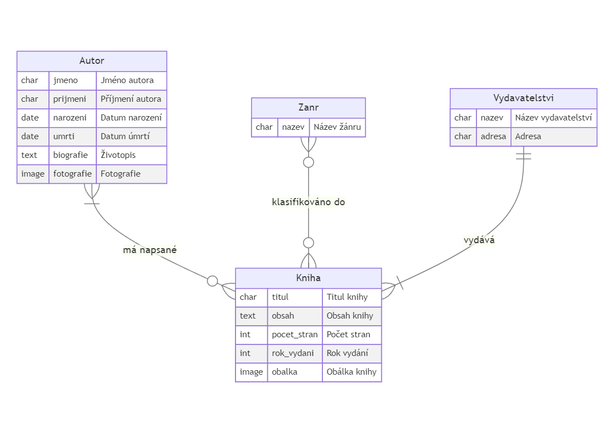
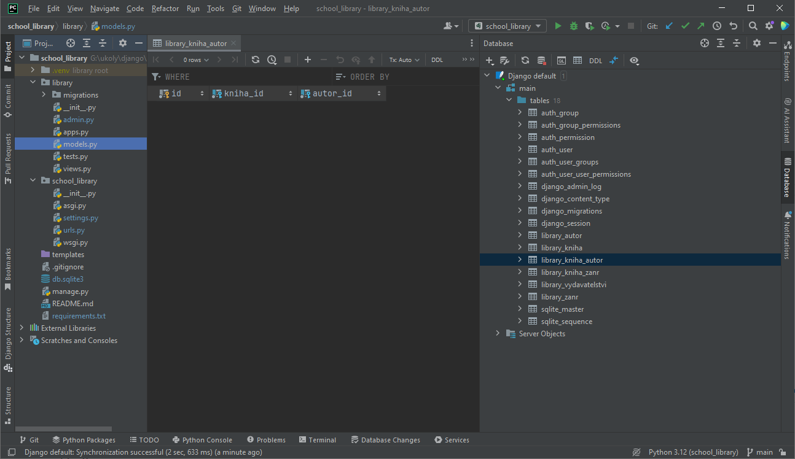
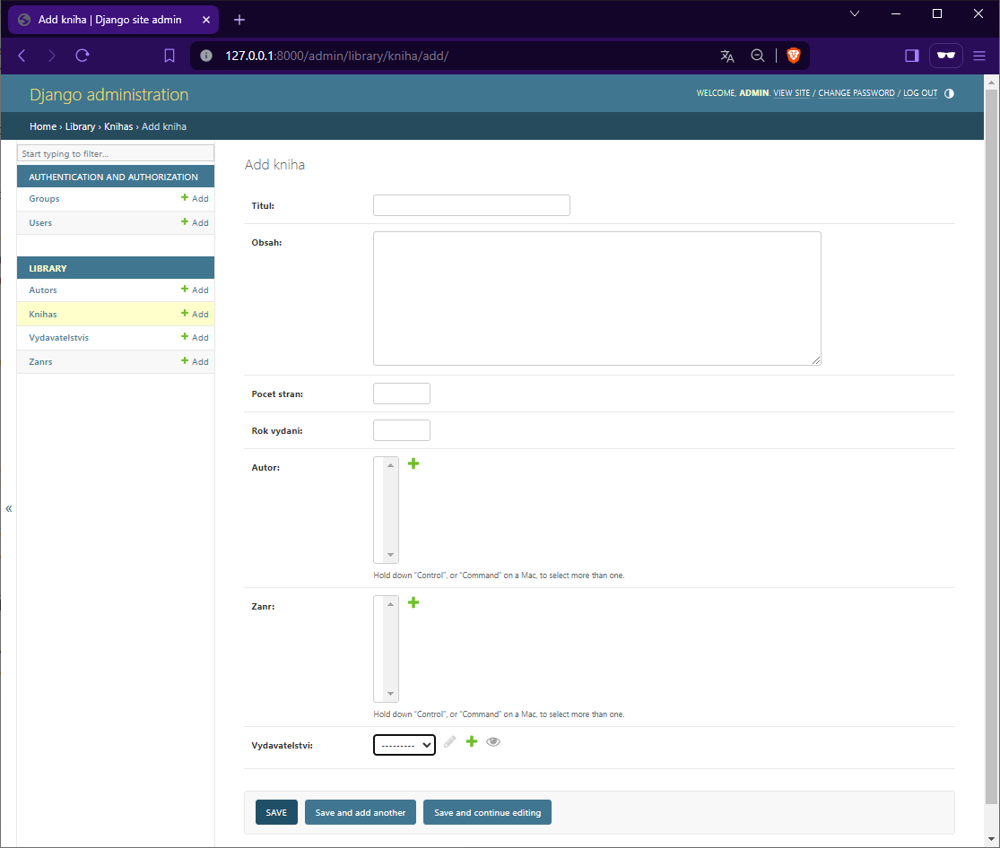

Datový model projektu
=====================

Poté, co jsme se seznámili se základy práce s modely v Django, je na čase se podívat na datový model našeho projektu. 
Konečným cílem je vytvořit funkční webovou aplikaci pro školní knihovnu, ale zatím si vystačíme s jednodušším modelem, 
který bude obsahovat pouze informace o knihách, včetně s nimi provázaných informacích o autorech, žánrech a vydavatelstvích.

ER diagram
----------
Budeme vycházet z následujícího ER diagramu:

ER diagram školní knihovny - základní datový model

V tomto případě jsme pro identifikaci jednotlivých entit i atributů použili pseudočeské názvy bez diakritiky.

- Entita `Autor` obsahuje informace o autorech knih. Každý autor má své jméno, příjmení, datum narození, případně i datum úmrtí, biografii (životopis) a fotografii.
- Entita `Zanr` obsahuje informace o žánrech knih. Každý žánr má svůj název.
- Entita `Vydavatelstvi` obsahuje informace o vydavatelstvích. Každé vydavatelství má svůj název a adresu.
- Entita `Kniha` obsahuje informace o knihách, které mohou být v knihovně k dispozici. Každá kniha má svůj titul, obsah, počet stran a rok vydání. 
  Tato entita je provázána s entitami `Autor`, `Zanr` a `Vydavatelstvi` pomocí různých typů vztahů. 
  Vztahy mezi knihou a autorem i knihou a žánrem jsou typu M:N, vztah mezi knihou a vydavatelstvím je typu 1:N.
  
Vytvoření modelů
----------------
Nyní si vytvoříme modely pro jednotlivé entity. Obsah existujícího souboru `models.py` v adresáři `library` přepíšeme následujícím kódem:

.. code:: python
  
      from django.db import models
  
      class Autor(models.Model):
          jmeno = models.CharField(max_length=100)
          prijmeni = models.CharField(max_length=100)
          narozeni = models.DateField()
          umrti = models.DateField(blank=True, null=True)
          zivotopis = models.TextField()
          fotografie = models.ImageField(upload_to='autori/')
  
          def __str__(self):
              return f'{self.jmeno} {self.prijmeni}'
  

      class Zanr(models.Model):
          nazev = models.CharField(max_length=100)
  
          def __str__(self):
              return self.nazev
  

      class Vydavatelstvi(models.Model):
          nazev = models.CharField(max_length=100)
          adresa = models.TextField()
  
          def __str__(self):
              return self.nazev
  

      class Kniha(models.Model):
          titul = models.CharField(max_length=100)
          obsah = models.TextField()
          pocet_stran = models.IntegerField()
          rok_vydani = models.IntegerField()
          autor = models.ManyToManyField(Autor)
          zanr = models.ManyToManyField(Zanr)
          vydavatelstvi = models.ForeignKey(Vydavatelstvi, on_delete=models.CASCADE)
  
          def __str__(self):
              return self.titul

Atributy a datová pole
----------------------
Vytvořili jsme čtyři modely, které odpovídají jednotlivým entitám z našeho datového modelu a použili jsme pole různých typů tak, aby odpovídala jednotlivým atributům.
Kompletní seznam všech dostupných polí najdete v dokumentaci k Django: 

`Oficiální dokumentace s přehledem typů polí používaných v modelech Django <https://docs.djangoproject.com/en/5.0/ref/models/fields/#field-types>`_

My si zde představíme pouze některé z nich, které jsme použili v našem modelu.

CharField
~~~~~~~~~
Pole `CharField` je určeno pro textové řetězce omezené délky. V našem případě jsme ho použili pro jméno, příjmení, název žánru, název vydavatelství a titul knihy.
Tento typ pole má povinný parametr `max_length`, který určuje maximální délku textového řetězce. V databázích je tento typ pole obvykle reprezentován jako `VARCHAR`.

`Oficiální dokumentace k poli CharField <https://docs.djangoproject.com/en/5.0/ref/models/fields/#charfield>`_

DateField
~~~~~~~~~
Pole `DateField` je určeno pro ukládání data. V našem případě jsme ho použili pro datum narození a úmrtí autora. 
Tento typ pole má nepovinné parametry `auto_now` a `auto_now_add`, které určují, zda se má při vytvoření nebo každé změně záznamu automaticky uložit aktuální datum a čas. 
V databázích je tento typ pole obvykle reprezentován jako `DATE`.

`Oficiální dokumentace k poli DateField <https://docs.djangoproject.com/en/5.0/ref/models/fields/#datefield>`_

TextField
~~~~~~~~~
Pole `TextField` je určeno pro textové řetězce libovolné délky. V našem případě jsme ho použili pro biografii autora, obsah knihy a adresu vydavatelství.
Tento typ pole je obvykle reprezentován jako `TEXT` v databázích. Mívá také nepovinný parametr `max_length`, který určuje maximální délku textového řetězce.

`Oficiální dokumentace k poli TextField <https://docs.djangoproject.com/en/5.0/ref/models/fields/#textfield>`_

IntegerField
~~~~~~~~~~~~

Pole `IntegerField` je určeno pro celá čísla. V našem případě jsme ho použili pro počet stran knihy a rok vydání.
Tento typ pole je obvykle reprezentován jako `INTEGER` v databázích. Mívá také nepovinné parametry `min_value` a `max_value`, 
které určují minimální a maximální hodnotu zadanou do číselného pole.

`Oficiální dokumentace k poli IntegerField <https://docs.djangoproject.com/en/5.0/ref/models/fields/#integerfield>`_

ImageField
~~~~~~~~~~

Pole `ImageField` je určeno pro ukládání obrázků. V našem případě jsme ho použili pro fotografii autora.
Tento typ pole má povinný parametr `upload_to`, který určuje cestu, kam se mají nahrávané soubory ukládat. 
V databázích je tento typ pole obvykle reprezentován jako `VARCHAR` s cestou k souboru.

`Oficiální dokumentace k poli ImageField <https://docs.djangoproject.com/en/5.0/ref/models/fields/#imagefield>`_

ManyToManyField
~~~~~~~~~~~~~~~

Pole `ManyToManyField` je určeno pro vztahy typu M:N mezi dvěma entitami. V našem případě jsme ho použili pro vztah mezi knihou a autorem a mezi knihou a žánrem.
Tento typ pole je obvykle reprezentován pomocí tzv. spojovací tabulky, která obsahuje cizí klíče na obě spojené tabulky. 
V našem případě se jedná o tabulky `library_kniha_autor` a `library_kniha_zanr`.

`Oficiální dokumentace k poli ManyToManyField <https://docs.djangoproject.com/en/5.0/ref/models/fields/#manytomanyfield>`_

ForeignKey
~~~~~~~~~~

Pole `ForeignKey` je určeno pro vztahy typu 1:N mezi dvěma entitami. V našem případě jsme ho použili pro vztah mezi knihou a vydavatelstvím.
Tento typ pole je obvykle reprezentován pomocí cizího klíče, který odkazuje na primární klíč v jiné tabulce.

`Oficiální dokumentace k poli ForeignKey <https://docs.djangoproject.com/en/5.0/ref/models/fields/#foreignkey>`_

Upload souborů
--------------
Vidíme, že pole `ImageField` má povinný parametr `upload_to`, který určuje cestu, kam se mají nahrávané soubory ukládat. 
Pro nahrávání souborů je potřeba vytvořit adresář `media`, který se bude nacházet v kořenové složce projektu. 
Tento adresář musí být veřejně přístupný a musí mít nastavená práva pro zápis.

V souboru `settings.py` v kořenové složce projektu musíme nastavit cestu k adresáři, kde se budou ukládat nahrávané soubory. Kód můžeme přidat na konec souboru.

.. code:: python

    MEDIA_URL = '/media/'
    MEDIA_ROOT = os.path.join(BASE_DIR, 'media')

Význam těchto dvou proměnných je následující:

- `MEDIA_URL` určuje URL adresu, pod kterou budou nahrávané soubory dostupné. 
  V našem případě se jedná o adresu `/media/`, takže nahrávané soubory budou dostupné na adrese `http://localhost:8000/media/`.
- `MEDIA_ROOT` určuje cestu k adresáři, kam se budou nahrávané soubory ukládat. Konstanta `BASE_DIR` obsahuje cestu k kořenové složce projektu, 
  takže výsledná cesta bude `BASE_DIR/media`.

Když nám PyCharm nabídne importovat chybějící modul `os`, můžeme to udělat klávesovou zkratkou `Alt+Enter`.

V adresáři `media` vytvoříme podadresář `autori`, kam se budou ukládat fotografie autorů.

Upravit bychom měli také kód v souboru `urls.py` v adresáři `school-library`, kde musíme přidat cestu k adresáři `media` do seznamu URL adres.
Při té příležitosti můžeme také přidat cestu k adresáři `static`, který bude obsahovat statické soubory, jako jsou například CSS styly nebo JavaScriptové soubory.

.. code:: python
    
    # ... již existující importy 
    from django.conf import settings
    from django.conf.urls.static import static

    urlpatterns = [
        # ... již existující cesty
    ]

    if settings.DEBUG:
        urlpatterns += static(settings.MEDIA_URL, document_root=settings.MEDIA_ROOT)
        urlpatterns += static(settings.STATIC_URL, document_root=settings.STATIC_ROOT)

Podmínka `if settings.DEBUG` zajišťuje, že se tyto cesty přidají pouze v případě, že je nastavena proměnná `DEBUG` na `True`, 
tedy když se projekt spouští v režimu vývoje.

Chyby při vytváření migrací
---------------------------
Z minulé kapitoly už víme, že po vytvoření modelů musíme připravit a aplikovat migrace, které vytvoří odpovídající tabulky v databázi.
Při pokusu o vytvoření však narazíme na chybu:

.. code:: bash

    python manage.py makemigrations
    
    Traceback (most recent call last):
      File "G:\ukoly\django\school_library\manage.py", line 22, in <module>
        main()
      File "G:\ukoly\django\school_library\manage.py", line 18, in main
        execute_from_command_line(sys.argv)
      File "G:\ukoly\django\school_library\.venv\Lib\site-packages\django\core\management\__init__.py", line 442, in execute_from_command_line
        utility.execute()
      File "G:\ukoly\django\school_library\.venv\Lib\site-packages\django\core\management\__init__.py", line 416, in execute
        django.setup()
      File "G:\ukoly\django\school_library\.venv\Lib\site-packages\django\__init__.py", line 24, in setup
        apps.populate(settings.INSTALLED_APPS)
      File "G:\ukoly\django\school_library\.venv\Lib\site-packages\django\apps\registry.py", line 124, in populate
        app_config.ready()
      File "G:\ukoly\django\school_library\.venv\Lib\site-packages\django\contrib\admin\apps.py", line 27, in ready
        self.module.autodiscover()
      File "G:\ukoly\django\school_library\.venv\Lib\site-packages\django\contrib\admin\__init__.py", line 52, in autodiscover
        autodiscover_modules("admin", register_to=site)
      File "G:\ukoly\django\school_library\.venv\Lib\site-packages\django\utils\module_loading.py", line 58, in autodiscover_modules
        import_module("%s.%s" % (app_config.name, module_to_search))
      File "C:\Users\ml\AppData\Local\Programs\Python\Python312\Lib\importlib\__init__.py", line 90, in import_module
        return _bootstrap._gcd_import(name[level:], package, level)
              ^^^^^^^^^^^^^^^^^^^^^^^^^^^^^^^^^^^^^^^^^^^^^^^^^^^^
      File "<frozen importlib._bootstrap>", line 1381, in _gcd_import
      File "<frozen importlib._bootstrap>", line 1354, in _find_and_load
      File "<frozen importlib._bootstrap>", line 1325, in _find_and_load_unlocked
      File "<frozen importlib._bootstrap>", line 929, in _load_unlocked
      File "<frozen importlib._bootstrap_external>", line 994, in exec_module
      File "<frozen importlib._bootstrap>", line 488, in _call_with_frames_removed
      File "G:\ukoly\django\school_library\library\admin.py", line 2, in <module>
        from .models import Author
    ImportError: cannot import name 'Author' from 'library.models' (G:\ukoly\django\school_library\library\models.py). Did you mean: 'Autor'?  

Chyba nastala při pokusu o import modelu `Author` z modulu `library.models`. Byla způsobena tím, že se v souboru `admin.py` vyskytuje
odkaz na původní model `Author`, který jsme nahradili modelem `Autor`. 

Úprava souboru `admin.py`
-------------------------
Opravíme tedy soubor `admin.py` v adresáři `library` následujícím způsobem:

.. code:: python

    from django.contrib import admin
    from .models import Autor, Zanr, Vydavatelstvi, Kniha

    admin.site.register(Autor)
    admin.site.register(Zanr)
    admin.site.register(Vydavatelstvi)
    admin.site.register(Kniha)

Přidali jsme import modelů `Autor`, `Zanr`, `Vydavatelstvi` a `Kniha` a zaregistrovali jsme je v administrátorském rozhraní.

Nyní se můžeme znovu pokusit vytvořit migrace:

.. code:: bash

    python manage.py makemigrations
    
    SystemCheckError: System check identified some issues:

    ERRORS:
    library.Autor.fotografie: (fields.E210) Cannot use ImageField because Pillow is not installed.
            HINT: Get Pillow at https://pypi.org/project/Pillow/ or run command "python -m pip install Pillow".    

Tentokrát narazíme na chybu, která nám říká, že nemůžeme použít pole `ImageField`, protože nemáme nainstalovaný modul `Pillow`.
Modul `Pillow` je knihovna pro práci s obrázky v jazyce Python. Její instalace je nutná pro použití pole `ImageField` v modelech Django.

Instalace modulu `Pillow`
-------------------------
Instalaci modulu `Pillow` provedeme pomocí následujícího příkazu:

.. code:: bash

    python -m pip install Pillow

    Collecting Pillow
      Downloading pillow-10.2.0-cp312-cp312-win_amd64.whl.metadata (9.9 kB)
    Downloading pillow-10.2.0-cp312-cp312-win_amd64.whl (2.6 MB)
      ━━━━━━━━━━━━━━━━━━━━━━━━━━━━━━━━━━━━━━━━ 2.6/2.6 MB 9.3 MB/s eta 0:00:00
    Installing collected packages: Pillow
    Successfully installed Pillow-10.2.0

Po instalaci externího modulu `Pillow` bychom měli aktualizovat seznam nainstalovaných balíčků v souboru `requirements.txt`:

.. code:: bash

    python -m pip freeze > requirements.txt

.. note:: 

    Příkaz ``python -m pip`` a pouze ``pip`` jsou dva způsoby, jak spustit nástroj pip pro správu balíčků v Pythonu. Existuje však několik rozdílů mezi nimi:

    1. ``python -m pip``: Tento způsob spouštění pip je založen na příkazu python s přepínačem -m, který umožňuje spouštět moduly jako skripty. Použití python -m pip zajistí, že se pip spustí v kontextu daného Python interpreteru. To je užitečné, pokud máte více verzí Pythonu nainstalovaných na vašem systému a chcete se ujistit, že instalujete balíčky do správného prostředí.
    2. ``pip``: Tento způsob spouštění pip je jednodušší a kratší. Pokud máte pouze jednu verzi Pythonu nainstalovanou na vašem systému a nemusíte se starat o specifické prostředí, můžete použít pouze pip.

    Oba způsoby mají své výhody a záleží na vašem konkrétním použití, který způsob je vhodnější.

Provedení migrací
-----------------
Po instalaci modulu `Pillow` se můžeme znovu pokusit vytvořit migrace:

.. code:: bash

    python manage.py makemigrations

    Migrations for 'library':
      library\migrations\0002_autor_kniha_vydavatelstvi_zanr_delete_author_and_more.py
        - Create model Autor
        - Create model Kniha
        - Create model Vydavatelstvi
        - Create model Zanr
        - Delete model Author
        - Add field vydavatelstvi to kniha
        - Add field zanr to kniha

Migrace byly tentokrát úspěšně vytvořeny. Nyní je můžeme aplikovat:

.. code:: bash

    python manage.py migrate

    Operations to perform:
      Apply all migrations: admin, auth, contenttypes, library, sessions
    Running migrations:
      Applying library.0002_autor_kniha_vydavatelstvi_zanr_delete_author_and_more... OK

Migrace byly úspěšně aplikovány a tabulky v databázi byly vytvořeny. 

Změny v databázi
----------------
Přesvědčíme se o tom při zobrazení obsahu databáze pomocí panelu `Database` v PyCharmu: 

Obsah databáze - seznam tabulek

Vidíme, že se nám podařilo vytvořit tabulky `library_autor`, `library_kniha`, `library_vydavatelstvi` a `library_zanr` a vytvořit vztahy mezi nimi.
S ohledem na to, že jsme mezi tabulkami použili také vztahy M:N, byly vytvořeny i spojovací tabulky `library_kniha_autor` a `library_kniha_zanr`.
Zároveň byla provedením migrací smazána tabulka `library_author`, která byla vytvořena v předchozí verzi modelu.

Změny v administraci
--------------------
Přesvědčíme se o tom v administrátorském rozhraní po spuštění vývojového serveru a přihlášení na adresu `http://127.0.0.1:8000/admin/`:

Administrátorské rozhraní - seznam modelů

Vidíme, že se nám podařilo vytvořit modely `Autor`, `Zanr`, `Vydavatelstvi` a `Kniha` a zaregistrovat je v administrátorském rozhraní.

Pokusíme-li se zobrazit formulář pro přidání nové knihy, uvidíme, že se nám podařilo vytvořit také vztahy mezi knihou a autorem, knihou a žánrem a knihou a vydavatelstvím.
Zatím však nemáme žádné autory, žánry ani vydavatelství, takže se nám nepodaří přidat žádnou knihu.

Ještě před tím, ale budeme muset vytvořené modely upravit a doplnit o některé volby, které nám umožní správně zobrazovat české popisky v administraci, 
zajistí správné chování v případě mazání záznamů, validaci dat i požadované zobrazení záznamů v jejich seznamu.

V další kapitole se tedy podíváme na možnosti úprav modelů a vytvoření vlastních metod pro zobrazení záznamů v administraci.