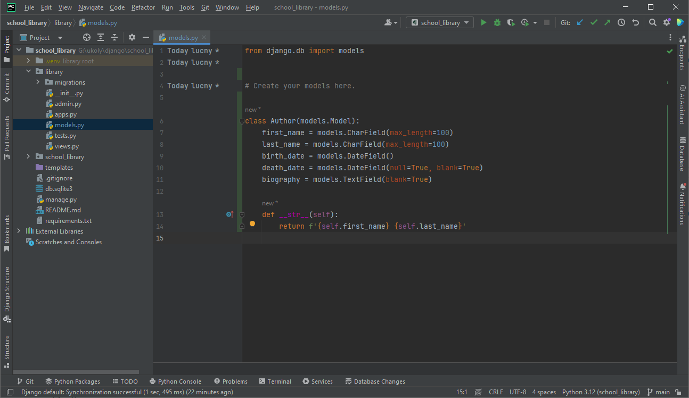

Práce s daty v Django
=====================

Základem naprosté většiny webových serverových aplikací je práce s daty. Nejinak je tomu i v případě našeho webu pro fiktivní školní knihovnu. 
Budeme potřebovat ukládat informace o knihách, autorech, vydavatelstvích, žánrech, čtenářích, výpůjčkách, případně i o dalších datových objektech.

Už jsme se v úvodních kapitolách zmínili, že Django má pro tyto účely vlastní vrstvu, která se označuje pojmem *modely*.

Modely
------
Modely jsou základním stavebním kamenem v Django, které popisují strukturu dat. 
Model je speciální druh třídy Pythonu, který je mapován na databázovou tabulku. Každý atribut modelu odpovídá sloupci v tabulce.

Modely nejenže definují strukturu dat, ale také poskytují rozhraní pro interakci s daty, včetně těch nejčastějších operací, které se obvykle
označují zkratkou *CRUD* (Create, Read, Update, Delete), tedy vytvoření, čtení, aktualizace a smazání dat.

.. note:: 

    Modely v Django jsou nezávislé na konkrétní databázi, což znamená, že můžeme použít libovolný databázový systém, který Django podporuje. 
    Patří mezi ně například relační databázové systémy SQLite, PostgreSQL, MySQL, Oracle, nebo dokonce i NoSQL databáze jako MongoDB.

    Využití relačních databází je však většinou nejrozšířenější volbou, neboť Django využívá technologie ORM (Object-Relational Mapping neboli objektově-relační mapování), 
    která umožňuje pracovat s daty v databázi pomocí objektů a metod, což je pro vývojáře mnohem příjemnější než psát SQL dotazy.

Tvorba modelu
-------------
Modely v Django jsou definovány v souborech s příponou `.py` a obvykle se umisťují do souborů s názvem `models.py`, které se nacházejí v adresáři aplikace 
(v našem případě ve složce ``library``).

Představu o tom, jak vypadá model v Django, si můžeme udělat na následujícím příkladu, který popisuje strukturu dat pro autora knihy:

.. code:: python

    from django.db import models

    class Author(models.Model):
        first_name = models.CharField(max_length=100)
        last_name = models.CharField(max_length=100)
        birth_date = models.DateField()
        death_date = models.DateField(null=True, blank=True)
        biography = models.TextField(blank=True)

        def __str__(self):
            return f'{self.first_name} {self.last_name}'

V tomto příkladu jsme definovali model `Author`, což je třída odvozená od třídy `models.Model`. 
Tato třída je základní třídou pro všechny modely v Django a poskytuje základní funkcionalitu pro práci s daty.

Náš jednoduchý model `Author` obsahuje následující atributy:
- `first_name` - křestní jméno autora
- `last_name` - příjmení autora
- `birth_date` - datum narození autora
- `death_date` - datum úmrtí autora (může být prázdné)
- `biography` - životopis autora (může být prázdný)

Každý atribut modelu je instance třídy `Field` z modulu `django.db.models`, která reprezentuje konkrétní typ sloupce v databázi. 
Například `CharField` reprezentuje textový sloupec s pevnou délkou, `DateField` reprezentuje sloupec s datem, `TextField` reprezentuje textový sloupec s proměnlivou délkou, atd.

Součástí každého atributu je také množství dalších parametrů, které umožňují nastavit různé vlastnosti sloupce, 
jako jsou například maximální délka textu (``max_length``), povinnost vyplnění (``null``), výchozí hodnota (``default``), atd.

Metoda `__str__` slouží k definici textové reprezentace objektu, která se zobrazuje například v administraci nebo v konzoli.

Model Author v souboru `models.py` v aplikaci `library`. 

Vytvoření tabulky v databázi
----------------------------
Vložíme-li náš model do souboru `models.py` v aplikační složce ``library``, ještě to samo o sobě nestačí k tomu, aby se vytvořila odpovídající tabulka v databázi.
Po definici modelu je nutné provést tzv. *migraci*, což je proces, kdy Django vytvoří nebo upraví databázové tabulky podle definice modelů.

Migrace se provádí pomocí příkazu `makemigrations` a `migrate` v rámci příkazové řádky.

Vytvoření migrace
~~~~~~~~~~~~~~~~~
Příkaz `makemigrations` vytvoří soubor s migrací, který obsahuje SQL příkazy pro vytvoření nebo úpravu tabulek v databázi podle definice modelů.

.. code:: bash

    python manage.py makemigrations

    Migrations for 'library':
    library\migrations\0001_initial.py
    - Create model Author

Tento příkaz provede analýzu modelů a vytvoří soubor s migrací, který se obvykle ukládá do složky `migrations` v adresáři aplikace. 
V našem případě by se měl vytvořit soubor s názvem `0001_initial.py`, protože se jedná o první migraci.

Provedení migrace
~~~~~~~~~~~~~~~~~
Příkaz `migrate` provede migraci, tedy vytvoří nebo upraví tabulky v databázi podle souborů s migracemi.

.. code:: bash

    python manage.py migrate

    Operations to perform:
    Apply all migrations: admin, auth, contenttypes, library, sessions
    Running migrations:
    Applying library.0001_initial... OK

Tento příkaz provede migraci podle všech souborů s migracemi, které byly vytvořeny příkazem `makemigrations`. 
V připojené databázi se vytvoří nebo upraví tabulky podle definice modelů. 

.. tip:: 
    Můžeme se také podívat na výstup tohoto příkazu, který nám ukáže, jaké SQL příkazy byly provedeny. To zjistíme pomocí přepínače `--verbosity 3`, například:

    .. code:: bash

        python manage.py migrate --verbosity 3  

    Tento příkaz nám vypíše detailní informace o tom, co bylo provedeno.

Přidání modelu do administrace
-------------------------------
Po vytvoření modelu a provedení migrace můžeme přidat náš model do administrace, což nám umožní spravovat data v našem modelu pomocí webového rozhraní.

V tomto případě budeme potřebovat vytvořit soubor `admin.py` v adresáři aplikace a přidat do něj následující kód:

.. code:: python

    from django.contrib import admin
    from .models import Author

    admin.site.register(Author)

Tento kód importuje třídu `Author` z našeho modelu a přidá ji do administrace pomocí funkce `admin.site.register`.

Po přidání modelu do administrace můžeme spustit vývojový server a přihlásit se do administrace, kde bychom měli vidět novou položku `Authors` v seznamu modelů 
(viz obrázek).

Administrace Django a nově vytvořená tabulka Authors

Vložení dat do databáze
------------------------
Nyní můžeme přidávat, upravovat a mazat autory přímo z administrace. Nejprve však musíme vytvořit alespoň jednoho autora, což můžeme udělat pomocí tlačítka `Add author`.

Administrace Django - přidání autora

Po vyplnění formuláře a uložení dat bychom měli vidět nově vytvořeného autora v seznamu autorů. 
Abychom mohli pracovat s rozsáhlejším seznamem autorů, přidáme ještě aspoň dva další autory.

Administrace Django - seznam autorů

Prohlížení dat v databázi
-------------------------
Vytvořené záznamy můžeme také prohlížet přímo v databázi. K tomu můžeme využít nástroj pro správu databáze, podle toho, jaký databázový systém 
zrovna používáme (např. phpMyAdmin v případě MySQL nebo MariaDB, pgAdmin v případě PostgreSQL, atd.). 

Protože v tuto chvíli ukládáme data do databáze SQLite, můžeme použít například program SQLite Browser, 
který je k dispozici pro všechny hlavní operační systémy a je možné ho stáhnout z oficiálních stránek na adrese `https://sqlitebrowser.org/ <https://sqlitebrowser.org/>`_  

Ještě jednodušší je však použít nástroj, který je součástí PyCharmu, a to databázový prohlížeč, který je integrován přímo do vývojového prostředí. 
Otevřeme-li panel `Database`, můžeme se připojit k databázi a prohlížet tabulky, záznamy, provádět dotazy, atd.

Databázový prohlížeč v PyCharmu

Vidíme, že databáze obsahuje tabulku `library_author`, která odpovídá našemu modelu `Author` vytvořenému v rámci aplikace `library`. 
A vidíme také, že v této tabulce jsou uloženy tři záznamy, které jsme vytvořili v administraci. 

.. note:: 

    Kromě námi vytvořené tabulky `library_author` obsahuje databáze i další tabulky. 
    Některé z těchto tabulek obsahují informace o uživatelích, skupinách, oprávněních, atd. Můžeme je identifikovat díky prefixu `auth_` nebo `django_`.
    Vznikly v rámci instalace frameworku Django a jsou součástí jeho základního nastavení. 

Součástí záznamů je trochu překvapivě i sloupec `id`, který je primárním klíčem tabulky. Přestože jsme ho v našem modelu neuváděli, Django ho automaticky vytvořil.
To je jedna z výhod použití Django ORM, které nám ušetří spoustu práce s databází.

.. note:: 
    Django automaticky vytváří primární klíč pro každý model, který se jmenuje `id` a v běžném nastavení je typu `BigAutoField`. 
    Tento klíč je unikátní pro každý záznam a slouží k identifikaci záznamu v databázi. 
    Je to tzv. *autoincrement* klíč, což znamená, že se hodnota tohoto klíče automaticky zvyšuje s každým novým záznamem.
    
    Pokud chceme, můžeme vytvořit vlastní primární klíč, který bude mít jiný název nebo bude jiného typu, např. `UUIDField`, 
    což je univerzální identifikátor, který je unikátní napříč všemi záznamy v databázi.

    Více informací o primárních klíčích a jejich vlastnostech najdeme v oficiální dokumentaci Django: 
    `Automatic primary key fields <https://docs.djangoproject.com/en/5.0/topics/db/models/#automatic-primary-key-fields>`_.
     

Závěr
-----
V této kapitole jsme se seznámili s modelem v Django, který popisuje strukturu dat. 
Ukázali jsme si jednoduchý příklad modelu `Author`, který obsahuje několik atributů, a vytvořili jsme tabulku v databázi podle tohoto modelu.
Nyní už víme, jak vytvořit a provést migraci, což je proces, kdy Django vytvoří nebo upraví databázové tabulky podle definice modelů.
Naučili jsme se také, jak přidat model do administrace a jak vložit data do databáze pomocí administrace nebo přímo v databázovém prohlížeči.

To, co jsme si předvedli na modelu `Author`, můžeme aplikovat i na další modely, které budeme v dalších kapitolách vytvářet pro naši školní knihovnu. 
