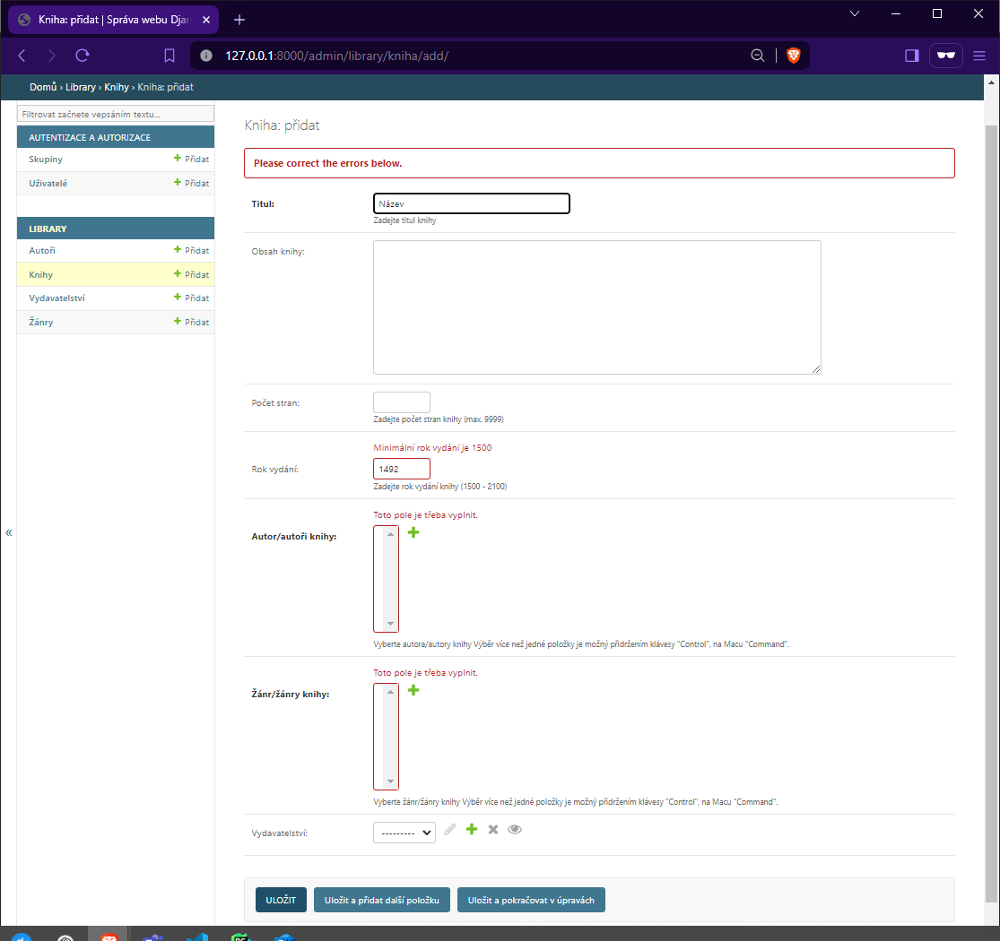

Úpravy modelů
=============

V této části se budeme věnovat podrobnějším úpravám modelů školní knihovny, které jsme vytvořili v minulé kapitole.

Chceme vytvořené modely upravit a doplnit o některé volby, které nám umožní správně zobrazovat české popisky v administraci, 
zajistí správné chování v případě mazání záznamů, validaci dat i požadované zobrazení záznamů v jejich seznamu.

Upravíme tedy náš soubor `models.py` takto:

.. code:: python

    from django.db import models
    from django.core.validators import MaxValueValidator, MinValueValidator

    # Create your models here.

    class Autor(models.Model):
        jmeno = models.CharField(max_length=100, verbose_name='Jméno', help_text='Zadejte jméno autora',
                                error_messages={'null': 'Zadejte jméno autora',
                                                'max_length': 'Maximální délka je 100 znaků',
                                                'blank': 'Jméno nesmí být prázdné'})
        prijmeni = models.CharField(max_length=100, verbose_name='Příjmení', help_text='Zadejte příjmení autora',
                                    error_messages={'null': 'Zadejte příjmení autora',
                                                    'max_length': 'Maximální délka je 100 znaků',
                                                    'blank': 'Příjmení nesmí být prázdné'})
        narozeni = models.DateField(blank=True, null=True, verbose_name='Datum narození',
                                    help_text='Zadejte datum narození autora')
        umrti = models.DateField(blank=True, null=True, verbose_name='Datum úmrtí',
                                help_text='Zadejte datum úmrtí autora')
        zivotopis = models.TextField(blank=True, null=True, verbose_name='Životopis')
        fotografie = models.ImageField(upload_to='autori/', blank=True, null=True, verbose_name='Fotografie autora')

        class Meta:
            ordering = ['prijmeni', 'jmeno']
            verbose_name = 'Autor'
            verbose_name_plural = 'Autoři'

        def __str__(self):
            return f'{self.jmeno[0]}. {self.prijmeni} ({self.narozeni.year}-{self.umrti.year})'

    class Zanr(models.Model):
        nazev = models.CharField(max_length=20, verbose_name='Název žánru', help_text='Zadejte název žánru',
                                error_messages={'null': 'Zadejte název žánru',
                                                'max_length': 'Maximální délka je 20 znaků',
                                                'blank': 'Název nesmí být prázdný'})

        class Meta:
            ordering = ['nazev']
            verbose_name = 'Žánr'
            verbose_name_plural = 'Žánry'

        def __str__(self):
            return self.nazev

    class Vydavatelstvi(models.Model):
        nazev = models.CharField(max_length=100, verbose_name='Název vydavatelství',
                                help_text='Zadejte název vydavatelství',
                                error_messages={'null': 'Zadejte název vydavatelství',
                                                'max_length': 'Maximální délka je 100 znaků',
                                                'blank': 'Název nesmí být prázdný'})
        adresa = models.TextField(blank=True, null=True, verbose_name='Adresa vydavatelství')

        class Meta:
            ordering = ['nazev']
            verbose_name = 'Vydavatelství'
            verbose_name_plural = 'Vydavatelství'

        def __str__(self):
            return self.nazev

    class Kniha(models.Model):
        titul = models.CharField(max_length=100, verbose_name='Titul', help_text='Zadejte titul knihy',
                                error_messages={'required': 'Titul je povinné pole',
                                                'max_length': 'Maximální délka je 100 znaků',
                                                'blank': 'Titul nesmí být prázdný'})
        obsah = models.TextField(blank=True, null=True, verbose_name='Obsah knihy')
        pocet_stran = models.PositiveIntegerField(blank=True, null=True, verbose_name='Počet stran',
                                                validators=[MaxValueValidator(9999)],
                                                error_messages={'max_value': 'Maximální počet stran je 9999'},
                                                help_text='Zadejte počet stran knihy (max. 9999)')
        rok_vydani = models.PositiveIntegerField(blank=True, null=True, verbose_name='Rok vydání',
                                                validators=[MinValueValidator(1500), MaxValueValidator(2100)],
                                                error_messages={'min_value': 'Minimální rok vydání je 1500',
                                                                'max_value': 'Maximální rok vydání je 2100'},
                                                help_text='Zadejte rok vydání knihy (1500 - 2100)')
        autor = models.ManyToManyField(Autor, verbose_name='Autor/autoři knihy', help_text='Vyberte autora/autory knihy',
                                    error_messages={'null': 'Vyberte autora/autory knihy',
                                                    'blank': 'Autor nesmí být prázdný'})
        zanr = models.ManyToManyField(Zanr, verbose_name='Žánr/žánry knihy', help_text='Vyberte žánr/žánry knihy',
                                    error_messages={'null': 'Vyberte žánr/žánry knihy',
                                                    'blank': 'Žánr nesmí být prázdný'})
        vydavatelstvi = models.ForeignKey(Vydavatelstvi, on_delete=models.RESTRICT, verbose_name='Vydavatelství',
                                        blank=True, null=True)

        class Meta:
            ordering = ['titul']
            verbose_name = 'Kniha'
            verbose_name_plural = 'Knihy'

        def __str__(self):
            return f'{self.titul} ({self.rok_vydani})'

Jak vidíte, přidali jsme několik nových vlastností a úprav, které nám umožní lépe spravovat data v administraci. 
Podívejme se nyní podrobněji na jednotlivé úpravy.

Vlastnosti polí
---------------
Vlastnosti polí jsou volby (v Pythonu se jim říká klíčové argumenty), které můžeme nastavit u každého pole v modelu.
Každé pole má své vlastní volby, některé jsou povinné, většinou jsou ale volitelné. 

`Oficiální dokumentace s přehledem vlastností polí používaných v modelech Django <https://docs.djangoproject.com/en/5.0/ref/models/fields/#field-options>`_

Společné vlastnosti
~~~~~~~~~~~~~~~~~~~
Část vlastností je společná pro všechny typy polí, patří k nim například:

``verbose_name``
    Název pole, který se zobrazuje v administraci. Pokud není nastaven, Django použije název pole s malými písmeny a nahradí podtržítky mezerami.
``help_text``
    Text, který se zobrazuje vedle pole v administraci a slouží k vysvětlení, jaký obsah má pole mít.
``blank``
    Pokud je nastaveno na ``True``, pole může být prázdné. Výchozí hodnota je ``False``.
``null``
    Pokud je nastaveno na ``True``, pole může být prázdné v databázi. Výchozí hodnota je ``False``.

    .. caution:: 
        
        Vlastnosti ``blank`` a ``null`` mohou být matoucí. 
        Zatímco ``blank`` se týká toho, zda může být pole prázdné ve formuláři, ``null`` se týká toho, zda může být pole prázdné v databázi.

        Výchozí nastavení je, že pole je povinné a nesmí být prázdné, tedy ``blank`` i ``null`` jsou standardně nastaveny na ``False``.
        Pokud je pole povinné, musí být nastavena vlastnost ``blank`` na ``False``. 
        
        Je-li pole povinné a prázdné, Django vyhodí chybu!
        
``default``
    Výchozí hodnota pole. Pokud není nastavena, výchozí hodnota je ``None``.
``editable``
    Pokud je nastaveno na ``False``, pole se nebude zobrazovat v administraci. Výchozí hodnota je ``True``.
``unique``
    Pokud je nastaveno na ``True``, hodnota pole musí být unikátní. Výchozí hodnota je ``False``.
``db_index``
    Pokud je nastaveno na ``True``, vytvoří se index pro toto pole v databázi. Výchozí hodnota je ``False``.
``db_column``
    Název sloupce v databázi. Pokud není nastaven, Django použije název pole s malými písmeny a nahradí podtržítky mezerami.
``db_tablespace``
    Tabulka v databázi, kam se uloží pole. Pokud není nastaveno, použije se výchozí tabulka.
``auto_created``
    Pokud je nastaveno na ``True``, pole bylo vytvořeno automaticky. Výchozí hodnota je ``False``.

Specifické vlastnosti
~~~~~~~~~~~~~~~~~~~~~
Některé vlastnosti jsou specifické pro určitý typ pole. Například pole ``CharField`` má vlastnost ``max_length``, která určuje maximální délku řetězce.

Přehled vybraných specifických vlastností:

``max_length``
    Maximální délka řetězce. Pokud je pole povinné, musí být nastavena. Výchozí hodnota je ``None``.
``upload_to``
    Cesta, kam se uloží nahraný soubor. Pokud není nastaveno, soubor se uloží do kořenového adresáře pro nahrané soubory.
``on_delete``
    Určuje, co se stane s cizím klíčem, pokud je smazán záznam, na který odkazuje. 
    V našem případě jsme nastavili, že se smazání záznamu vydavatelství omezí, pokud na něj odkazuje nějaká kniha. Použili jsme hodnotu ``models.RESTRICT``.
    Jiné možnosti jsou: 
    
    - ``models.CASCADE`` - smazání záznamu způsobí smazání všech záznamů, které na něj odkazují.
    - ``models.SET_NULL`` - smazání záznamu způsobí nastavení cizího klíče na ``NULL``.
    - ``models.SET_DEFAULT`` - smazání záznamu způsobí nastavení cizího klíče na výchozí hodnotu.
    - ``models.SET()`` -  smazání záznamu způsobí nastavení cizího klíče na zadanou hodnotu.

``auto_now``
    Platí pouze pro pole typu ``DateTimeField`` a ``DateField``.
    Pokud je nastaveno na ``True``, pole se automaticky nastaví na aktuální datum nebo čas při vytvoření záznamu. Výchozí hodnota je ``False``.
``auto_now_add``
    Opět platí pouze pro pole typu ``DateTimeField`` a ``DateField``.
    Pokud je nastaveno na ``True``, pole se automaticky nastaví na aktuální datum nebo čas při vytvoření záznamu, ale nezmění se při aktualizaci záznamu. 
    Výchozí hodnota je ``False``.

Validace dat
------------
Důležitou roli hrají v modelech také validátory. Validátory jsou funkce, které ověřují, zda je hodnota pole platná a splňuje požadavky na formát, rozsah, atd.
Validaci můžeme provádět na úrovni pole, formuláře nebo pohledu.

Na úrovni pole se validace provádí pomocí vlastnosti ``validators``. Jedná se o seznam validátorů, které se použijí při validaci hodnoty pole.
Validátory jsou funkce, které ověřují, zda je hodnota pole platná. Pokud validace selže, Django vyhodí chybu.

V našem případě jsme například použili validátory pro minimální a maximální hodnotu pole ``rok_vydani``. 
Tyto validátory zajistí, že rok vydání knihy bude v rozmezí hodnot 1500 - 2100. 

Námi použité validátory jsou součástí Django a jsou dostupné v modulu ``django.core.validators``. Patří k nim ještě například validátory pro e-mail, URL, atd.

`Oficiální dokumentace s přehledem vestavěných validátorů <https://docs.djangoproject.com/en/5.0/ref/validators/#built-in-validators>`_

Kromě vestavěných validátorů můžeme vytvořit i vlastní validátory. Vlastní validátory jsou funkce, které ověřují, zda je hodnota pole platná.
Způsob, jak se vytvářejí vlastní validátory, naleznete v oficiální dokumentaci.

`Oficiální dokumentace o validátorech v Django <https://docs.djangoproject.com/en/5.0/ref/validators/>`_

Chybové zprávy
--------------
Další důležitou vlastností polí jsou chybové zprávy. Chybové zprávy se zobrazí, pokud validace selže.
Chybové zprávy můžeme nastavit pomocí vlastnosti ``error_messages``. Jedná se o slovník, který umožňuje nastavit jednu nebo více chybových zpráv pro pole.

Příklady chybových zpráv, které můžeme nastavit:

``required``
    Chybová zpráva pro povinné pole.
``max_length``
    Chybová zpráva pro maximální délku řetězce.
``min_length``
    Chybová zpráva pro minimální délku řetězce.
``invalid``
    Chybová zpráva pro neplatný formát.
``null``
    Chybová zpráva pro povinnost pole být prázdné.
``blank``
    Chybová zpráva pro povinnost pole být neprázdné.
``unique``
    Chybová zpráva pro unikátnost hodnoty pole.
``unique_for_date``
    Chybová zpráva pro unikátnost hodnoty pole v rámci data.

.. caution:: 

    Chybové zprávy můžeme nastavit pouze pro některé validátory. 
    Pokud chceme nastavit chybovou zprávu pro jiný validátor, musíme vytvořit vlastní validátor.

    Jestliže chybovou zprávu nenastavíme, Django použije výchozí chybovou zprávu, která bude v angličtině.

Metadatové vlastnosti
---------------------
Metadatové vlastnosti jsou volby, které ovlivňují chování modelu jako celku. Nastavují se ve speciální třídě ``Meta`` uvnitř třídy modelu.

``ordering``
    Určuje výchozí pořadí záznamů v seznamu. V našem případě jsme nastavili, že záznamy budou seřazeny primárně podle příjmení autora a 
    sekundárně podle jména autora. 
    
    .. note:: 

        Výchozí způsob řazení je podle primárního klíče. Pokud chceme změnit výchozí řazení, musíme nastavit vlastnost ``ordering``.
        Chceme-li záznamy seřadit podle více sloupců, oddělíme je čárkou.
        Sestupné řazení záznamů získáme přidáním znaménka mínus před název sloupce - např. ``ordering = ['-prijmeni', 'jmeno']``.

``verbose_name``
    Název modelu v jednotném čísle. Pokud není nastaven, Django použije název třídy s malými písmeny a nahradí podtržítky mezerami.
``verbose_name_plural``
    Název modelu v množném čísle. Pokud není nastaven, Django použije název třídy s malými písmeny a nahradí podtržítky mezerami.

Další metadatové vlastnosti jsou popsány v oficiální dokumentaci: 

`Metadatové vlastnosti modelů <https://docs.djangoproject.com/en/5.0/ref/models/options/>`_.

Metody modelu
-------------
Metody modelu jsou funkce, které můžeme vytvořit uvnitř třídy modelu. 
Tyto metody můžeme použít k různým účelům, například k vytvoření vlastního zobrazení záznamu v seznamu, k vytvoření vlastního zobrazení záznamu v administraci, atd.

V našem případě jsme v každém modelu vytvořili metodu ``__str__``, která vrací textovou reprezentaci záznamu. Používáme ji k zobrazení záznamu v administraci.

Využíváme k tomu tzv. f-string, který v jazyce Python umožňuje vkládat proměnné do řetězce pomocí závorek a znaku ``f`` před řetězcem.
Součástí takového řetězce mohou být i funkce, které modifikují proměnné.

Příkladem může být úprava zobrazení textové reprezentace objektu autora. 

.. code:: python

    def __str__(self):
        return f'{self.jmeno[0]}. {self.prijmeni} ({self.narozeni.year}-{self.umrti.year})'

Místo zobrazení celého křestního jména a příjmení zobrazíme křestní jméno pouze počátečním písmenem.
K tomu jsme do závorky připojili rok narození a úmrtí.

.. note:: 

    Klíčové slovo ``self`` odkazuje na aktuální instanci třídy, tedy na datový záznam, který reprezentuje objekt v databázi. 
    Pokud bychom v řetězci použili pouze self, získali bychom textovou reprezentaci objektu, která by obsahovala název třídy a primární klíč.
    To je výchozí chování modelu v Django, pokud metoda ``__str__`` není vytvořena.

Více o metodách modelu naleznete v oficiální dokumentaci: 

`Metody modelu <https://docs.djangoproject.com/en/5.0/topics/db/models/#model-methods>`_.

Ověření správnosti úprav
------------------------
Po provedení úprav v souboru `models.py` spusťte příkaz ``python manage.py makemigrations`` a poté ``python manage.py migrate``.
Pokud se vám podaří migrace vytvořit a aplikovat, znamená to, že jste úpravy provedli správně.

Většinu úprav můžete ověřit také v administraci, kde se zobrazí nové vlastnosti polí, validátory, chybové zprávy a metadatové vlastnosti.

Příklad zobrazení v administraci:

Zobrazení modelu Kniha v administraci

- Metody modelu se projeví v zobrazení záznamů v seznamu a v detailu záznamu.
- Ve formulářích se projeví vlastnosti polí, validátory a chybové zprávy.
- Metadatové vlastnosti se projeví v zobrazení záznamů v seznamu, což budeme moci ověřit až po vložení nějakých záznamů do databáze.

Závěr
-----
V této kapitole jsme se podrobněji seznámili s úpravami modelů školní knihovny 
a naučili se využívat vlastnosti polí, validátory, chybové zprávy, metadatové vlastnosti a metody modelu.

